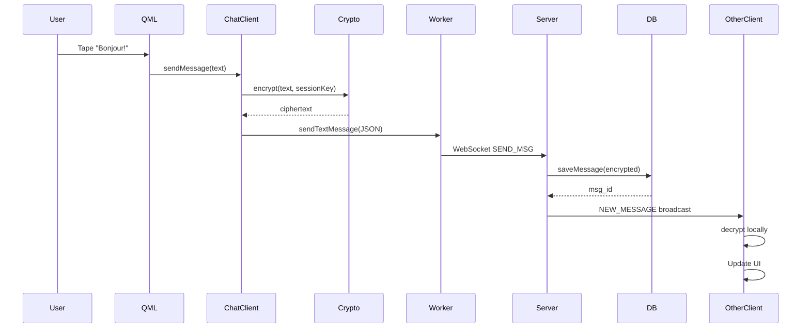
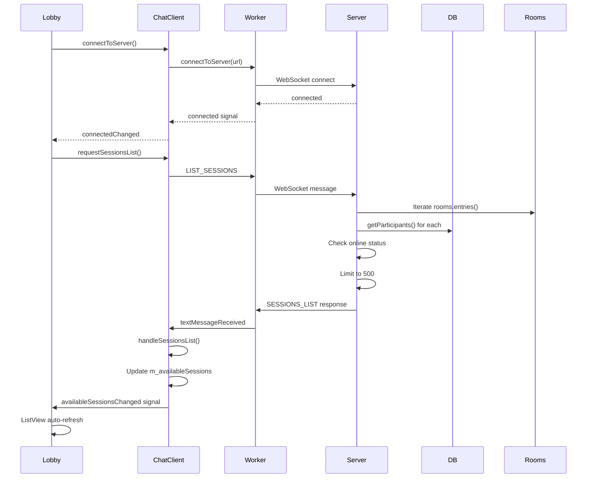

# Architecture du Serveur Chat Meownopoly
## Cours Pedagogique Complet

---

# PARTIE I: FONDEMENTS ET DEFINITIONS

## Chapitre 1: Vue d'Ensemble de l'Architecture

### 1.1 Concept Central: Blind Relay

**Definition**: Un serveur "Blind Relay" (relais aveugle) est un intermediaire qui transmet des donnees chiffrees sans avoir la capacite de les dechiffrer. Il assure le routage et la persistance sans acces au contenu.

**Caracteristiques**:
- Le serveur ne possede JAMAIS les cles de dechiffrement
- Stockage uniquement de payloads chiffres (blobs opaques)
- Metadata publiques seulement (ID, timestamps, compteurs)
- Zero-knowledge du contenu echange

### 1.2 Stack Technologique

**Architecture en 3 couches**:

```
┌─────────────────────────────────────────┐
│   COUCHE PRESENTATION (Interface)       │
│   - QML (Interface utilisateur)         │
│   - Qt Quick Controls                   │
│   - Bindings reactifs                   │
└──────────────┬──────────────────────────┘
               │
┌──────────────▼──────────────────────────┐
│   COUCHE LOGIQUE (Client C++)           │
│   - ChatClient (coordinateur)           │
│   - ChatWorker (thread WebSocket)       │
│   - ChatCrypto (chiffrement E2EE)       │
│   - ChatDatabase (SQLite local)         │
└──────────────┬──────────────────────────┘
               │ WebSocket (ws://)
┌──────────────▼──────────────────────────┐
│   COUCHE SERVEUR (Node.js)              │
│   - WebSocket Server (ws library)       │
│   - Routeur de commandes                │
│   - Gestionnaire de sessions (rooms)    │
│   - Base de donnees SQLite              │
└─────────────────────────────────────────┘
```

**Technologies utilisees**:
- **Frontend**: Qt 6.x, QML, C++17
- **Backend**: Node.js v18+, WebSocket (ws), SQLite (better-sqlite3)
- **Securite**: ChaCha20-Poly1305, PBKDF2
- **Transport**: WebSocket bidirectionnel

**Fichiers principaux**:
- Serveur: `chatServer/server.js`, `database.js`, `cleanup.js`
- Client C++: `cpp/chat/chat_client.h/cpp`, `chat_worker.h/cpp`, `chat_crypto.h/cpp`
- Interface QML: `qml/chat/ChatDrawer.qml`, `qml/multiplayer/SessionList.qml`

---

## Chapitre 2: Modele de Donnees et Persistence

### 2.1 Schema SQLite Serveur

**Fichier**: `chatServer/database.js` (lignes 10-40)

```sql
-- Table des sessions (salons de chat / parties)
CREATE TABLE sessions (
    session_id TEXT PRIMARY KEY,        -- Identifiant unique
    key_package TEXT,                   -- Cle chiffree (blob opaque)
    key_nonce TEXT,                     -- Nonce pour dechiffrement
    version INTEGER DEFAULT 1,          -- Version de cle (rotation)
    created_at TIMESTAMP DEFAULT CURRENT_TIMESTAMP
);

-- Table des messages (historique chiffre)
CREATE TABLE messages (
    id INTEGER PRIMARY KEY AUTOINCREMENT,
    session_id TEXT,                    -- Reference a sessions
    sender_id TEXT,                     -- ID expediteur
    sender_nickname TEXT,               -- Pseudo expediteur
    payload TEXT,                       -- Message CHIFFRE (blob opaque)
    nonce TEXT,                         -- Nonce unique par message
    key_version INTEGER,                -- Version cle utilisee
    server_timestamp TIMESTAMP DEFAULT CURRENT_TIMESTAMP,
    FOREIGN KEY(session_id) REFERENCES sessions(session_id)
);

-- Table des participants (membres des sessions)
CREATE TABLE participants (
    session_id TEXT,
    player_id TEXT,                     -- ID joueur unique
    nickname TEXT,                      -- Pseudo affiche
    joined_at TIMESTAMP DEFAULT CURRENT_TIMESTAMP,
    PRIMARY KEY (session_id, player_id) -- Cle composite
);
```

**Index de performance**:
```sql
CREATE INDEX idx_messages_session_id ON messages(session_id);
```

### 2.2 Definitions Cles

**Session**: Salon de chat ou partie de jeu. Identifiee par `session_id` (ex: "ABC-1234")

**Lock Key**: Cle derivee de `sessionId + password`. Utilisee pour chiffrer les Session Keys localement.
```
lockKey = PBKDF2(sessionId + password, iterations=10000, length=32 bytes)
```

**Session Key**: Cle symetrique aleatoire (32 bytes) pour chiffrer les messages. Change a chaque rotation.

**Nonce**: Nombre unique (Number used ONCE) pour garantir qu'un meme message chiffre deux fois donnera des resultats differents.

**Forward Secrecy**: Un nouveau participant ne peut pas lire les anciens messages (rotation de cle obligatoire).

### 2.3 Structure Memoire (Rooms Map)

**Fichier**: `server.js` ligne 118

```javascript
// Map<SessionID, Set<WebSocket>>
const rooms = new Map();

Exemple:
rooms = {
  "ABC-1234" => Set {
    WebSocket#1 (player_id: "alice", status: OPEN),
    WebSocket#2 (player_id: "bob", status: OPEN),
    WebSocket#3 (player_id: "charlie", status: CLOSED)
  },
  "XYZ-5678" => Set {
    WebSocket#4 (player_id: "dave", status: OPEN)
  }
}
```

**Distinction importante**:
- `rooms` = sessions actives EN MEMOIRE (volatiles)
- `participants` (DB) = membres PERSISTANTS (survivent aux deconnexions)

---

## Chapitre 3: Protocole de Communication

### 3.1 Format des Messages WebSocket

**Structure JSON standard**:
```json
{
  "type": "COMMAND_NAME",
  "payload": {
    "param1": "value1",
    "param2": "value2"
  }
}
```

### 3.2 Commandes Client vers Serveur

**Fichier**: `server.js` lignes 157-182

| Commande | Payload | Description |
|----------|---------|-------------|
| `JOIN_SESSION` | `{session_id, player_id, player_nickname}` | Rejoindre une session |
| `PUBLISH_KEY` | `{session_id, blob, nonce}` | Publier cle de session |
| `SEND_MSG` | `{session_id, sender_id, ciphertext, nonce, key_v}` | Envoyer message chiffre |
| `GET_HISTORY` | `{session_id, before_id?}` | Recuperer historique (pagination) |
| `GET_PARTICIPANTS` | `{session_id}` | Liste des participants |
| `LIST_SESSIONS` | `{}` | Liste toutes les sessions actives |
| `LEAVE_SESSION` | `{session_id, player_id}` | Quitter explicitement |
| `DELETE_SESSION` | `{session_id}` | Supprimer session definitivement |
| `CLEAR_HISTORY` | `{session_id}` | Effacer historique |

### 3.3 Reponses Serveur vers Client

| Type | Payload | Contexte |
|------|---------|----------|
| `INIT_SESSION` | `{current_version, keys[], history[], new_joiner}` | Apres JOIN_SESSION |
| `NEW_MESSAGE` | `{msg_id, sender_id, payload, nonce, timestamp}` | Broadcast nouveau message |
| `PARTICIPANTS_LIST` | `{session_id, count, participants[]}` | Reponse GET_PARTICIPANTS |
| `SESSIONS_LIST` | `{sessions[], total, limit, limited}` | Reponse LIST_SESSIONS |
| `NEW_PARTICIPANT` | `{session_id, player_id, nickname}` | Broadcast nouveau membre |
| `PARTICIPANT_LEFT` | `{session_id, player_id}` | Broadcast depart membre |
| `KEY_UPDATE` | `{version, key_package, nonce}` | Broadcast rotation cle |
| `HISTORY_RESULT` | `{history[]}` | Historique demande |
| `SESSION_ENDED` | `{session_id}` | Session supprimee |
| `ERROR` | `{code, message}` | Erreur serveur |

### 3.4 Limites de Protection

**Fichier**: `server.js` lignes 18-23

```javascript
const MAX_PAYLOAD_SIZE = 10 * 1024 * 1024;  // 10 MB max par message
const MAX_DB_SIZE = 500 * 1024 * 1024;      // 500 MB database max
const MAX_SESSIONS = 500;                    // 500 sessions actives max
```

**Mecanismes de defense**:
1. Validation taille message (ligne 129)
2. Limite sessions actives (ligne 194)
3. Nettoyage DB automatique (> 500 MB)
4. TTL optionnel (24h par defaut)

---

# PARTIE II: PARCOURS CHRONOLOGIQUE (Du User au Serveur)

## Chapitre 4: Couche Interface (QML)

### 4.1 Declenchement Action Utilisateur

**Exemple concret 1**: Lobby Multiplayer
**Fichier**: `qml/multiplayer/SessionList.qml` ligne 60

```qml
Component.onCompleted: {
    console.log("🚀 SessionList loaded, connecting to server...")
    lobbyChatClient.connectToServer(
        "ws://localhost:3000",
        AccountManager.uniqueId,
        "lobby_password",
        AccountManager.nickname
    )
}
```

**Flux**:
```
1. User ouvre lobby (clic "Start Game")
2. SessionList.qml charge
3. Component.onCompleted execute
4. Appel lobbyChatClient.connectToServer()
   -> Entre dans couche C++
```

**Exemple concret 2**: Envoi Message Chat
**Fichier**: `qml/chat/ChatInputBar.qml`

```qml
Button {
    text: "Envoyer"
    onClicked: {
        if (messageInput.text.trim() !== "") {
            chatClient.sendMessage(messageInput.text.trim())
            messageInput.clear()
        }
    }
}
```

### 4.2 Binding aux Proprietes C++

**Fichier**: `qml/multiplayer/SessionList.qml` lignes 19-43

```qml
ChatClient {
    id: lobbyChatClient
    sessionId: "lobby_discovery"
    
    // Signal automatique quand connected change
    onConnectedChanged: {
        if (connected) {
            lobbyChatClient.requestSessionsList()
            refreshTimer.start()
        }
    }
    
    // Signal automatique quand availableSessions change
    onAvailableSessionsChanged: {
        console.log("📋 Sessions updated:", lobbyChatClient.availableSessions.length)
        // ListView.model se met a jour automatiquement
    }
}

ListView {
    model: lobbyChatClient.availableSessions  // Binding reactif
    delegate: SessionCard { ... }
}
```

**Mecanisme Qt**: Quand `m_availableSessions` change en C++, le signal `availableSessionsChanged()` est emis. QML re-evalue automatiquement `lobbyChatClient.availableSessions` et met a jour le model de la ListView.

---

## Chapitre 5: Couche Logique (C++ ChatClient)

### 5.1 Reception Appel depuis QML

**Fichier**: `cpp/chat/chat_client.h` lignes 36-48

```cpp
// Methodes invocables depuis QML (macro Q_INVOKABLE)
Q_INVOKABLE void connectToServer(const QString &url, const QString &playerId, 
                                   const QString &password, const QString &nickname = QString());
Q_INVOKABLE void sendMessage(const QString &text);
Q_INVOKABLE void requestHistory(int beforeId = -1);
Q_INVOKABLE void requestParticipants();
Q_INVOKABLE void requestSessionsList();
```

**Exemple**: `requestSessionsList()`
**Fichier**: `cpp/chat/chat_client.cpp` lignes 326-339

```cpp
void ChatClient::requestSessionsList() {
    // Verification pre-requise
    if (!m_connected) {
        qWarning() << "[ChatClient] Cannot request sessions list: not connected";
        return;
    }
    
    qDebug() << "[ChatClient] Requesting sessions list";
    
    // Construction message JSON
    QJsonObject msg;
    msg["type"] = "LIST_SESSIONS";
    msg["payload"] = QJsonObject();  // Payload vide
    
    // Envoi via worker thread
    sendWebSocketMessage(msg);
}
```

### 5.2 Preparation et Chiffrement

**Exemple**: Envoi message texte
**Fichier**: `cpp/chat/chat_client.cpp` (fonction sendMessage)

```cpp
void ChatClient::sendMessage(const QString &text) {
    if (!m_connected || m_sessionKeys.isEmpty()) return;
    
    // 1. Obtenir cle de session courante
    QByteArray sessionKey = m_sessionKeys.value(m_currentKeyVersion);
    
    // 2. Generer nonce unique (24 bytes aleatoires)
    QByteArray nonce = ChatCrypto::generateNonce();
    
    // 3. Chiffrer message
    QByteArray plaintext = text.toUtf8();
    QByteArray ciphertext = ChatCrypto::encrypt(plaintext, sessionKey, nonce);
    
    // 4. Encoder en Base64 pour JSON
    QString ciphertextB64 = ciphertext.toBase64();
    QString nonceB64 = nonce.toBase64();
    
    // 5. Construire message WebSocket
    QJsonObject msg;
    msg["type"] = "SEND_MSG";
    QJsonObject payload;
    payload["session_id"] = m_sessionId;
    payload["sender_id"] = m_playerId;
    payload["sender_nickname"] = m_nickname;
    payload["ciphertext"] = ciphertextB64;
    payload["nonce"] = nonceB64;
    payload["key_v"] = m_currentKeyVersion;
    msg["payload"] = payload;
    
    // 6. Envoi
    sendWebSocketMessage(msg);
}
```

### 5.3 Architecture Multi-Thread

**Fichier**: `cpp/chat/chat_client.cpp` lignes 13-34

```cpp
ChatClient::ChatClient(QObject *parent) : QObject(parent) {
    // Base de donnees locale
    m_db.init();
    
    // Creation thread dedie
    m_workerThread = new QThread(this);
    m_worker = new ChatWorker();
    m_worker->moveToThread(m_workerThread);
    
    // Connexion signaux cross-thread
    connect(m_worker, &ChatWorker::connected, this, &ChatClient::onConnected);
    connect(m_worker, &ChatWorker::textMessageReceived, 
            this, &ChatClient::onTextMessageReceived);
    
    m_workerThread->start();
}
```

**Pourquoi un thread separe?**
- WebSocket operations bloquantes
- UI reste reactive
- Pas de freeze interface
- Qt signal/slot thread-safe

---

## Chapitre 6: Couche Transport (ChatWorker)

### 6.1 Invocation Cross-Thread

**Fichier**: `cpp/chat/chat_client.cpp` lignes 138-142

```cpp
void ChatClient::sendWebSocketMessage(const QJsonObject &message) {
    QString jsonString = QJsonDocument(message).toJson(QJsonDocument::Compact);
    
    // Invocation asynchrone dans le thread worker
    QMetaObject::invokeMethod(m_worker, "sendTextMessage", Qt::QueuedConnection,
                              Q_ARG(QString, jsonString));
}
```

**Mecanisme**:
1. `QMetaObject::invokeMethod` = appel de methode inter-threads
2. `Qt::QueuedConnection` = asynchrone (pas d'attente)
3. Message place dans event queue du thread worker
4. Worker traite quand il est pret

### 6.2 WebSocket Bas Niveau

**Fichier**: `cpp/chat/chat_worker.h` lignes 18-28

```cpp
public slots:
    void connectToServer(const QString &url);
    void sendTextMessage(const QString &message);
    void disconnectFromServer();

signals:
    void connected();
    void disconnected();
    void textMessageReceived(const QString &message);
    void errorOccurred(const QString &error);
```

**Implementation** (chat_worker.cpp):
```cpp
void ChatWorker::connectToServer(const QString &url) {
    m_webSocket = new QWebSocket();
    
    connect(m_webSocket, &QWebSocket::connected, this, &ChatWorker::onConnected);
    connect(m_webSocket, &QWebSocket::textMessageReceived, 
            this, &ChatWorker::onTextMessageReceived);
    
    m_webSocket->open(QUrl(url));  // ws://localhost:3000
}

void ChatWorker::sendTextMessage(const QString &message) {
    if (m_webSocket && m_webSocket->state() == QAbstractSocket::ConnectedState) {
        m_webSocket->sendTextMessage(message);  // Envoi WebSocket
    }
}
```

---

## Chapitre 7: Serveur Node.js (Traitement)

### 7.1 Reception et Parsing

**Fichier**: `server.js` lignes 126-143

```javascript
wss.on('connection', (ws) => {
    debug('New client connected');
    
    ws.on('message', (data) => {
        try {
            // 1. Validation taille
            if (data.length > MAX_PAYLOAD_SIZE) {
                return sendError(ws, 'PAYLOAD_TOO_LARGE', 
                    `Message exceeds ${MAX_PAYLOAD_SIZE / (1024 * 1024)}MB limit`);
            }
            
            // 2. Parsing JSON
            const message = JSON.parse(data);
            debug(`Received command: ${message.type}`, message.payload);
            
            // 3. Routage
            handleCommand(ws, message);
            
            // 4. Verification taille DB
            checkDbSize();
        } catch (err) {
            sendError(ws, 'INVALID_FORMAT', 'Message must be valid JSON');
        }
    });
});
```

### 7.2 Routeur de Commandes

**Fichier**: `server.js` lignes 152-187

```javascript
function handleCommand(ws, msg) {
    const { type, payload } = msg;
    
    switch (type) {
        case 'JOIN_SESSION':
            handleJoinSession(ws, payload);
            break;
        case 'SEND_MSG':
            handleSendMessage(ws, payload);
            break;
        case 'LIST_SESSIONS':
            handleListSessions(ws);
            break;
        // ... autres cases
        default:
            sendError(ws, 'UNKNOWN_COMMAND', `Command ${type} not recognized`);
    }
}
```

**Pattern**: Un handler par commande pour separation des responsabilites.

### 7.3 Acces Base de Donnees

**Exemple**: Sauvegarde message
**Fichier**: `server.js` ligne 312

```javascript
const result = db.saveMessage(session_id, sender_id, nickname, 
                               ciphertext, nonce, key_v);
```

**Fichier**: `database.js` lignes 84-89

```javascript
saveMessage: (sessionId, senderId, senderNickname, payload, nonce, keyVersion) => {
    return db.prepare(`
        INSERT INTO messages (session_id, sender_id, sender_nickname, payload, nonce, key_version)
        VALUES (?, ?, ?, ?, ?, ?)
    `).run(sessionId, senderId, senderNickname || '', payload, nonce, keyVersion);
}
```

**Le serveur ne voit JAMAIS**: Le message dechiffre. `payload` est un blob opaque (Base64 du ciphertext).

---

## Chapitre 8: Retour au Client (Reponses)

### 8.1 Construction Reponse Serveur

**Exemple**: Liste sessions
**Fichier**: `server.js` lignes 446-454

```javascript
ws.send(JSON.stringify({
    type: 'SESSIONS_LIST',
    payload: {
        sessions: limitedSessions,  // Array d'objets session
        total: activeSessions.length,
        limit: MAX_SESSIONS,
        limited: activeSessions.length > MAX_SESSIONS
    }
}));
```

### 8.2 Reception et Dispatch C++

**Fichier**: `cpp/chat/chat_client.cpp` lignes 144-172

```cpp
void ChatClient::onTextMessageReceived(const QString &message) {
    // 1. Parsing JSON
    QJsonDocument doc = QJsonDocument::fromJson(message.toUtf8());
    QJsonObject obj = doc.object();
    QString type = obj["type"].toString();
    QJsonObject payload = obj["payload"].toObject();
    
    // 2. Dispatch selon type
    if (type == "INIT_SESSION") {
        handleInitSession(payload);
    } else if (type == "NEW_MESSAGE") {
        handleNewMessage(payload);
    } else if (type == "SESSIONS_LIST") {
        handleSessionsList(payload);
    } else if (type == "PARTICIPANTS_LIST") {
        handleParticipantsList(payload);
    }
    // ... autres handlers
}
```

### 8.3 Mise a Jour Proprietes et Signaux

**Exemple**: Mise a jour liste sessions
**Fichier**: `cpp/chat/chat_client.cpp` lignes 276-307

```cpp
void ChatClient::handleSessionsList(const QJsonObject &payload) {
    // 1. Vider liste precedente
    m_availableSessions.clear();
    
    // 2. Parser array JSON
    QJsonArray sessions = payload["sessions"].toArray();
    
    // 3. Transformer en QVariantMap pour QML
    for (const QJsonValue &val : sessions) {
        QJsonObject session = val.toObject();
        
        QVariantMap sessionMap;
        sessionMap["name"] = session["session_id"].toString();
        sessionMap["sessionId"] = session["session_id"].toString();
        sessionMap["players"] = session["player_count"].toInt();
        sessionMap["maxPlayers"] = session["max_players"].toInt();
        sessionMap["hostNickname"] = session["host_nickname"].toString();
        
        m_availableSessions.append(sessionMap);
    }
    
    // 4. Emettre signal vers QML
    emit availableSessionsChanged();
}
```

### 8.4 Mise a Jour Automatique UI

**QML recoit signal** (`onAvailableSessionsChanged`):

```qml
ListView {
    model: lobbyChatClient.availableSessions  // Re-evalue automatiquement
    // UI se rafraichit sans code supplementaire
}
```

**Mecanisme Qt**: Property binding reactif. Quand `availableSessionsChanged()` est emis, toutes les expressions QML utilisant `availableSessions` sont re-evaluees.

---

# PARTIE III: CAS D'USAGE DETAILLES (Code Reel)

## Chapitre 9: Cas 1 - Chat de Partie

### 9.1 Contexte

**Interface**: Panel lateral pendant partie de jeu
**Fichier**: `qml/chat/ChatDrawer.qml`

```qml
Drawer {
    id: chatDrawer
    edge: Qt.RightEdge
    
    property string gameId: ""  // ID de la partie en cours
    
    ChatClient {
        id: chatClient
        sessionId: chatDrawer.gameId
    }
}
```

### 9.2 Flux Complet: Envoi Message

**Etape 1: User tape message**
```
User: "Bonjour les chats!"
  |
  v
TextField { text: "Bonjour les chats!" }
```

**Etape 2: Clic bouton Envoyer**
```qml
onClicked: {
    chatClient.sendMessage(messageInput.text.trim())
}
```

**Etape 3: Chiffrement C++**
```cpp
// chat_client.cpp
plaintext = "Bonjour les chats!".toUtf8()
sessionKey = m_sessionKeys[1]  // Ex: version 1
nonce = generateNonce()        // 24 bytes aleatoires

ciphertext = ChaCha20Poly1305(plaintext, sessionKey, nonce)
// Result: 0x4f8a3c... (blob illisible)
```

**Etape 4: Envoi WebSocket**
```json
{
  "type": "SEND_MSG",
  "payload": {
    "session_id": "game-ABC123",
    "sender_id": "alice-uuid",
    "sender_nickname": "Alice",
    "ciphertext": "T4o8Y3ZhbGxpc...",  // Base64 du blob
    "nonce": "kJ8mN5xQ2...",
    "key_v": 1
  }
}
```

**Etape 5: Serveur traite**
```javascript
// server.js ligne 305-337
function handleSendMessage(ws, payload) {
    // Sauvegarde SANS dechiffrer
    db.saveMessage(session_id, sender_id, nickname, ciphertext, nonce, key_v);
    
    // Broadcast a tous les clients de la room
    const room = rooms.get(session_id);
    room.forEach(client => {
        client.send(JSON.stringify({
            type: 'NEW_MESSAGE',
            payload: {
                msg_id: 42,
                sender_id: "alice-uuid",
                sender_nickname: "Alice",
                payload: "T4o8Y3ZhbGxpc...",  // TOUJOURS CHIFFRE
                nonce: "kJ8mN5xQ2...",
                key_version: 1,
                timestamp: "2026-02-09T10:30:00Z"
            }
        }));
    });
}
```

**Etape 6: Autres clients recoivent**
```cpp
// chat_client.cpp
void ChatClient::handleNewMessage(const QJsonObject &payload) {
    QString ciphertextB64 = payload["payload"].toString();
    QString nonceB64 = payload["nonce"].toString();
    int keyVersion = payload["key_version"].toInt();
    
    // Dechiffrement local
    QByteArray ciphertext = QByteArray::fromBase64(ciphertextB64.toUtf8());
    QByteArray nonce = QByteArray::fromBase64(nonceB64.toUtf8());
    QByteArray sessionKey = m_sessionKeys.value(keyVersion);
    
    QByteArray plaintext = ChatCrypto::decrypt(ciphertext, sessionKey, nonce);
    QString message = QString::fromUtf8(plaintext);
    // Result: "Bonjour les chats!"
    
    // Ajouter a la liste
    m_messages.append(messageMap);
    emit messagesChanged();  // -> QML affiche
}
```

**Etape 7: Affichage UI**
```qml
ListView {
    model: chatClient.messages
    delegate: ChatMessageDelegate {
        messageText: model.text  // "Bonjour les chats!"
        senderName: model.sender // "Alice"
    }
}
```

**Diagramme de sequence**:



---

## Chapitre 10: Cas 2 - Lobby Multijoueur

### 10.1 Contexte

**Interface**: Liste des parties disponibles
**Fichier**: `qml/multiplayer/SessionList.qml`

### 10.2 Flux Complet: Decouverte Sessions

**Etape 1: Ouverture lobby**
```qml
Component.onCompleted: {
    lobbyChatClient.connectToServer(
        "ws://localhost:3000",
        AccountManager.uniqueId,
        "lobby_password",
        AccountManager.nickname
    )
}
```

**Etape 2: Connexion etablie**
```cpp
// chat_client.cpp lignes 108-125
void ChatClient::onConnected() {
    m_connected = true;
    emit connectedChanged();  // -> QML onConnectedChanged
    
    // Join session "lobby_discovery"
    QJsonObject join;
    join["type"] = "JOIN_SESSION";
    join["payload"] = {
        "session_id": "lobby_discovery",
        "player_id": m_playerId,
        "player_nickname": m_nickname
    };
    sendWebSocketMessage(join);
}
```

**Etape 3: QML detecte connexion**
```qml
onConnectedChanged: {
    if (connected) {
        lobbyChatClient.requestSessionsList()  // Demande liste
        refreshTimer.start()                    // Auto-refresh 5s
    }
}
```

**Etape 4: Envoi requete**
```cpp
// chat_client.cpp lignes 326-339
void ChatClient::requestSessionsList() {
    QJsonObject msg;
    msg["type"] = "LIST_SESSIONS";
    msg["payload"] = QJsonObject();  // Vide
    sendWebSocketMessage(msg);
}
```

**Etape 5: Serveur interroge BD et rooms**
```javascript
// server.js lignes 407-457
function handleListSessions(ws) {
    const activeSessions = [];
    
    // Iterer sur toutes les rooms actives
    for (const [sessionId, clients] of rooms.entries()) {
        const participants = db.getParticipants(sessionId);
        const session = db.getSession(sessionId);
        
        if (participants.length > 0) {
            // Compter joueurs en ligne
            const onlinePlayerIds = new Set();
            for (const client of clients) {
                if (client.player_id && client.readyState === WebSocket.OPEN) {
                    onlinePlayerIds.add(client.player_id);
                }
            }
            
            activeSessions.push({
                session_id: sessionId,
                host_id: participants[0].player_id,
                host_nickname: participants[0].nickname,
                player_count: participants.length,
                max_players: 4,
                online_count: onlinePlayerIds.size,
                status: participants.length >= 4 ? 'full' : 'available'
            });
        }
    }
    
    // Tri + limitation
    activeSessions.sort((a, b) => new Date(b.created_at) - new Date(a.created_at));
    const limitedSessions = activeSessions.slice(0, MAX_SESSIONS);
    
    // Envoi reponse
    ws.send(JSON.stringify({
        type: 'SESSIONS_LIST',
        payload: {
            sessions: limitedSessions,
            total: activeSessions.length,
            limit: MAX_SESSIONS,
            limited: activeSessions.length > MAX_SESSIONS
        }
    }));
}
```

**Etape 6: Client traite reponse**
```cpp
// chat_client.cpp lignes 276-307
void ChatClient::handleSessionsList(const QJsonObject &payload) {
    m_availableSessions.clear();
    
    QJsonArray sessions = payload["sessions"].toArray();
    
    for (const QJsonValue &val : sessions) {
        QJsonObject session = val.toObject();
        
        QVariantMap sessionMap;
        sessionMap["name"] = session["session_id"].toString();
        sessionMap["sessionId"] = session["session_id"].toString();
        sessionMap["players"] = session["player_count"].toInt();
        sessionMap["maxPlayers"] = session["max_players"].toInt();
        
        m_availableSessions.append(sessionMap);
    }
    
    emit availableSessionsChanged();  // -> QML
}
```

**Etape 7: QML affiche**
```qml
onAvailableSessionsChanged: {
    console.log("📋 Sessions updated:", lobbyChatClient.availableSessions.length)
    // ListView.model = availableSessions
    // Delegates SessionCard instantiees automatiquement
}
```

**Etape 8: Rafraichissement automatique**
```qml
Timer {
    interval: 5000
    repeat: true
    onTriggered: {
        lobbyChatClient.requestSessionsList()  // Boucle toutes les 5s
    }
}
```

**Diagramme de sequence**:



---

## Chapitre 11: Cas 3 - Gestion Participants

### 11.1 Contexte

**Interface**: Panel participants dans chat
**Fichier**: `qml/chat/ChatDrawer.qml` lignes 98-150

```qml
Rectangle {
    id: participantsPanel
    
    Repeater {
        model: chatClient.participants
        delegate: Rectangle {
            Row {
                Text { text: model.player_nickname }
                Text { 
                    text: model.status === "online" ? "🟢" : "⚫"
                    color: model.status === "online" ? "#4caf50" : "#666666"
                }
            }
        }
    }
}
```

### 11.2 Flux: Demande Participants

**Etape 1: User ouvre panel**
```qml
onToggleParticipantsPanel: {
    participantsPanel.visible = !participantsPanel.visible
    if (participantsPanel.visible) {
        chatClient.requestParticipants()
    }
}
```

**Etape 2: Envoi requete**
```cpp
// chat_client.cpp lignes 310-324
void ChatClient::requestParticipants() {
    QJsonObject request;
    request["type"] = "GET_PARTICIPANTS";
    QJsonObject payload;
    payload["session_id"] = m_sessionId;
    request["payload"] = payload;
    
    sendWebSocketMessage(request);
}
```

**Etape 3: Serveur determine status**
```javascript
// server.js lignes 372-405
function handleGetParticipants(ws, payload) {
    const { session_id } = payload;
    const dbParticipants = db.getParticipants(session_id);
    const room = rooms.get(session_id);
    
    const participants = dbParticipants.map(p => {
        let isOnline = false;
        
        // VERIFIER SI WEBSOCKET OUVERT
        if (room) {
            for (const client of room) {
                if (client.player_id === p.player_id && 
                    client.readyState === WebSocket.OPEN) {
                    isOnline = true;
                    break;
                }
            }
        }
        
        return {
            player_id: p.player_id,
            player_nickname: p.nickname,
            status: isOnline ? 'online' : 'offline'
        };
    });
    
    ws.send(JSON.stringify({
        type: 'PARTICIPANTS_LIST',
        payload: { session_id, count: participants.length, participants }
    }));
}
```

**Distinction cruciale**:
- `DB participants` = Membres persistants (TOUJOURS presentes)
- `rooms clients` = Connexions actives (VOLATILES)
- `status` = Croisement des deux (online si dans DB ET WebSocket ouvert)

**Etape 4: Client met a jour**
```cpp
// chat_client.cpp lignes 258-274
void ChatClient::handleParticipantsList(const QJsonObject &payload) {
    m_participants.clear();
    QJsonArray participantsArray = payload["participants"].toArray();
    
    for (const QJsonValue &val : participantsArray) {
        QJsonObject p = val.toObject();
        QVariantMap participant;
        participant["player_id"] = p["player_id"].toString();
        participant["player_nickname"] = p["player_nickname"].toString();
        participant["status"] = p["status"].toString();  // online/offline
        m_participants.append(participant);
    }
    
    emit participantsChanged();
}
```

**Etape 5: UI affiche avec indicateur**
```qml
Repeater {
    model: chatClient.participants
    delegate: Row {
        Text { text: model.player_nickname }
        Text { 
            text: model.status === "online" ? "🟢" : "⚫"
        }
    }
}
```

---

## Chapitre 12: Cas 4 - Historique Messages

### 12.1 Contexte

**Besoin**: Charger anciens messages lors du scroll vers le haut (pagination)

### 12.2 Flux: Chargement Historique

**Etape 1: Scroll detection**
```qml
ListView {
    onContentYChanged: {
        if (contentY < 50 && !atYBeginning) {
            chatClient.requestHistory()
        }
    }
}
```

**Etape 2: Requete avec pagination**
```cpp
void ChatClient::requestHistory(int beforeId) {
    QJsonObject msg;
    msg["type"] = "GET_HISTORY";
    QJsonObject payload;
    payload["session_id"] = m_sessionId;
    if (beforeId > 0) {
        payload["before_id"] = beforeId;  // Messages avant cet ID
    }
    msg["payload"] = payload;
    sendWebSocketMessage(msg);
}
```

**Etape 3: Serveur recupere DB**
```javascript
// server.js lignes 339-348
function handleGetHistory(ws, payload) {
    const { session_id, before_id } = payload;
    
    const history = db.getHistory(session_id, 50, before_id);
    
    ws.send(JSON.stringify({
        type: 'HISTORY_RESULT',
        payload: { history }
    }));
}
```

**Database.js** (lignes 90-103):
```javascript
getHistory: (sessionId, limit = 50, beforeId = null) => {
    if (beforeId) {
        // Pagination: messages AVANT cet ID
        return db.prepare(`
            SELECT * FROM messages 
            WHERE session_id = ? AND id < ? 
            ORDER BY id DESC LIMIT ?
        `).all(sessionId, beforeId, limit).reverse();
    }
    // Initial: 50 derniers messages
    return db.prepare(`
        SELECT * FROM messages 
        WHERE session_id = ? 
        ORDER BY id DESC LIMIT ?
    `).all(sessionId, limit).reverse();
}
```

**Etape 4: Client dechiffre et affiche**
```cpp
void ChatClient::handleHistoryResult(const QJsonObject &payload) {
    QJsonArray history = payload["history"].toArray();
    
    for (const QJsonValue &val : history) {
        QJsonObject msg = val.toObject();
        
        // Dechiffrement
        QByteArray plaintext = ChatCrypto::decrypt(
            ciphertext, sessionKey, nonce
        );
        
        // Insertion AVANT messages existants (ordre chronologique)
        m_messages.prepend(messageMap);
    }
    
    emit messagesChanged();
}
```

**Pagination intelligente**:
```
Premier chargement: 50 derniers messages (before_id = null)
Scroll up: 50 messages avant ID=42 (before_id = 42)
Scroll up: 50 messages avant ID=1 (before_id = 1)
...
```

---

# PARTIE IV: MECANISMES AVANCES

## Chapitre 13: Securite et Chiffrement

### 13.1 Derivation Lock Key

**Fichier**: `cpp/chat/chat_client.cpp` lignes 67-68

```cpp
void ChatClient::connectToServer(..., const QString &password, ...) {
    m_password = password;
    
    // Derive Lock Key from SessionID + Password
    m_lockKey = ChatCrypto::deriveLockKey(m_sessionId, m_password);
}
```

**Algorithme**: PBKDF2 (Password-Based Key Derivation Function 2)

```cpp
// chat_crypto.cpp
QByteArray ChatCrypto::deriveLockKey(const QString &sessionId, const QString &password) {
    QString combined = sessionId + password;
    QByteArray salt = "meownopoly_salt";
    
    return QPasswordDigestor::deriveKeyPbkdf2(
        QCryptographicHash::Sha256,
        combined.toUtf8(),
        salt,
        10000,    // Iterations
        32        // 256 bits
    );
}
```

**Exemple concret**:
```
sessionId = "game-ABC123"
password = "secret_password"
combined = "game-ABC123secret_password"

lockKey = PBKDF2(combined, iterations=10000)
        = 0x3f8a9c2e... (32 bytes)
```

### 13.2 Generation Session Key

**Aleatoire pur** (32 bytes):
```cpp
QByteArray ChatCrypto::generateSessionKey() {
    return QRandomGenerator::global()->generate(32);
}
```

**Chiffrement avec Lock Key** (avant envoi serveur):
```cpp
QByteArray sessionKey = generateSessionKey();  // Cle aleatoire
QByteArray nonce = generateNonce();            // 24 bytes
QByteArray encryptedKey = encrypt(sessionKey, m_lockKey, nonce);

// Envoi au serveur (PUBLISH_KEY)
payload["blob"] = encryptedKey.toBase64();
payload["nonce"] = nonce.toBase64();
```

### 13.3 Rotation de Cle (Forward Secrecy)

**Declencheur**: Nouveau participant rejoint

**Fichier**: `server.js` lignes 251-263

```javascript
if (isNewParticipant) {
    // Marquer session comme necessitant rotation
    keyRotationRequired.add(session_id);
    
    // Notifier tous les membres actuels
    currentRoom.forEach(client => {
        if (client !== ws && client.readyState === WebSocket.OPEN) {
            client.send(JSON.stringify({
                type: 'NEW_PARTICIPANT',
                payload: { session_id, player_id, nickname }
            }));
        }
    });
}
```

**Client existant recoit NEW_PARTICIPANT**:
```cpp
// chat_client.cpp
void ChatClient::handleNewParticipant(const QJsonObject &payload) {
    QString newPlayerId = payload["player_id"].toString();
    
    emit participantJoined(newPlayerId, nickname);
    
    // Generer nouvelle cle
    publishNewKey();
}

void ChatClient::publishNewKey() {
    // 1. Generer nouvelle session key
    QByteArray newSessionKey = ChatCrypto::generateSessionKey();
    
    // 2. Chiffrer avec lockKey
    QByteArray nonce = ChatCrypto::generateNonce();
    QByteArray encryptedKey = ChatCrypto::encrypt(newSessionKey, m_lockKey, nonce);
    
    // 3. Envoyer au serveur
    QJsonObject msg;
    msg["type"] = "PUBLISH_KEY";
    msg["payload"] = {
        "session_id": m_sessionId,
        "blob": encryptedKey.toBase64(),
        "nonce": nonce.toBase64()
    };
    sendWebSocketMessage(msg);
    
    // 4. Stocker localement
    m_sessionKeys.insert(++m_currentKeyVersion, newSessionKey);
    m_db.saveSessionKey(m_sessionId, m_currentKeyVersion, encryptedKey, nonce);
}
```

**Serveur broadcast KEY_UPDATE**:
```javascript
// server.js lignes 267-295
function handlePublishKey(ws, payload) {
    const { session_id, blob, nonce } = payload;
    
    // Incrementer version
    const result = db.updateSession(session_id, blob, nonce);
    const version = result.version;
    
    // Retirer flag rotation
    keyRotationRequired.delete(session_id);
    
    // Broadcast a tous
    const room = rooms.get(session_id);
    room.forEach(client => {
        client.send(JSON.stringify({
            type: 'KEY_UPDATE',
            payload: { version, key_package: blob, nonce }
        }));
    });
}
```

**Tous les clients mettent a jour**:
```cpp
void ChatClient::handleKeyUpdate(const QJsonObject &payload) {
    int version = payload["version"].toInt();
    QByteArray keyPkg = QByteArray::fromBase64(payload["key_package"].toUtf8());
    QByteArray nonce = QByteArray::fromBase64(payload["nonce"].toUtf8());
    
    // Dechiffrer avec lockKey
    QByteArray sessionKey = ChatCrypto::decrypt(keyPkg, m_lockKey, nonce);
    
    // Stocker
    m_sessionKeys.insert(version, sessionKey);
    m_currentKeyVersion = version;
    
    // Persister localement
    m_db.saveSessionKey(m_sessionId, version, keyPkg, nonce);
}
```

**Resultat**: Nouveau membre ne peut pas dechiffrer anciens messages (Forward Secrecy).

---

## Chapitre 14: Gestion du Cycle de Vie

### 14.1 Persistance vs Volatilite

**Distinction fondamentale**:

| Aspect | Base de Donnees (DB) | Map rooms (Memoire) |
|--------|---------------------|---------------------|
| **Duree de vie** | Persistante (fichier) | Volatile (RAM) |
| **Survit a** | Redemarrage serveur | Rien |
| **Contenu** | Participants, messages, cles | WebSocket actifs |
| **Signification** | "Qui est membre" | "Qui est connecte" |

**Comportement deconnexion**:

```javascript
// server.js ligne 145-148
ws.on('close', () => {
    debug('Client disconnected');
    removeFromRooms(ws);  // Retire de rooms Map SEULEMENT
    // participants table INCHANGEE !
});

function removeFromRooms(ws) {
    if (ws.session_id && rooms.has(ws.session_id)) {
        rooms.get(ws.session_id).delete(ws);
    }
}
```

**Resultat**:
- Player ferme application -> WebSocket close -> Retire de `rooms`
- Player rouvre application -> JOIN_SESSION -> `isKnownParticipant=true` -> Re-ajoute a `rooms`
- Historique disponible (cles stockees localement)

### 14.2 Quitter Explicitement vs Deconnexion

**Deconnexion** (fermeture app):
```
- rooms.delete(ws)
- participants table INCHANGEE
- Status devient "offline"
- Peut rejoindre plus tard
```

**Quitter explicitement** (LEAVE_SESSION):
```javascript
// server.js lignes 459-491
function handleLeaveSession(ws, payload) {
    const { session_id, player_id } = payload;
    
    // Supprimer de la DB
    db.removeParticipant(session_id, player_id);
    
    // Broadcast aux autres
    room.forEach(client => {
        if (client.readyState === WebSocket.OPEN) {
            client.send(JSON.stringify({
                type: 'PARTICIPANT_LEFT',
                payload: { session_id, player_id }
            }));
        }
    });
    
    // Retirer de rooms
    removeFromRooms(ws);
}
```

**Resultat**: Participant definitivement supprime. Ne peut plus rejoindre sans invitation.

### 14.3 Nettoyage Automatique (TTL)

**Fichier**: `cleanup.js`

```javascript
function cleanupOldData(hours = 24) {
    const cutoff = new Date(Date.now() - hours * 60 * 60 * 1000);
    
    // Supprimer vieux messages
    db.prepare('DELETE FROM messages WHERE server_timestamp < ?').run(cutoff);
    
    // Supprimer sessions inactives sans messages
    db.prepare(`
        DELETE FROM sessions 
        WHERE created_at < ? 
        AND session_id NOT IN (SELECT DISTINCT session_id FROM messages)
    `).run(cutoff);
}
```

**Activation**: `server.js` lignes 10-16
```javascript
const enableTtl = process.env.ENABLE_TTL !== 'false';
if (enableTtl) {
    cleanup.init(60 * 60 * 1000);  // Toutes les heures
}
```

---

## Chapitre 15: Gestion des Erreurs

### 15.1 Validation Cote Serveur

**Taille payload**:
```javascript
// server.js ligne 129
if (data.length > MAX_PAYLOAD_SIZE) {
    return sendError(ws, 'PAYLOAD_TOO_LARGE', 
        `Message exceeds ${MAX_PAYLOAD_SIZE / (1024 * 1024)}MB limit`);
}
```

**Limite sessions**:
```javascript
// server.js lignes 194-196
if (!rooms.has(session_id) && rooms.size >= MAX_SESSIONS) {
    return sendError(ws, 'MAX_SESSIONS_REACHED', 
        `Server has reached maximum capacity (${MAX_SESSIONS} active sessions).`);
}
```

**Rotation obligatoire**:
```javascript
// server.js lignes 307-309
if (keyRotationRequired.has(session_id)) {
    return sendError(ws, 'KEY_ROTATION_REQUIRED', 
        'A new participant joined; a client must publish a new key');
}
```

### 15.2 Fonction sendError

```javascript
function sendError(ws, code, message) {
    if (ws.readyState === WebSocket.OPEN) {
        ws.send(JSON.stringify({
            type: 'ERROR',
            payload: { code, message }
        }));
    }
}
```

### 15.3 Traitement Erreurs Cote Client

**Fichier**: `cpp/chat/chat_client.cpp` lignes 341-352

```cpp
void ChatClient::handleError(const QJsonObject &payload) {
    QString code = payload["code"].toString();
    QString message = payload["message"].toString();
    
    if (code == "KEY_ROTATION_REQUIRED") {
        // Erreur recuperable: publier nouvelle cle
        qDebug() << "[ChatClient] Server requires key rotation; publishing new key.";
        m_retryPending = true;
        publishNewKey();
    } else {
        // Erreur non recuperable: notifier UI
        qWarning() << "[ChatClient] Server error:" << code << message;
        emit errorOccurred(message);  // -> QML affiche
    }
}
```

**QML affiche erreur**:
```qml
ChatClient {
    onErrorOccurred: function(error) {
        errorText.text = "Erreur: " + error
        errorText.visible = true
    }
}

Text {
    id: errorText
    visible: false
    color: "#f44336"
}
```

---

# ANNEXES

## Annexe A: Reference Rapide des Commandes

### Client -> Serveur

```javascript
// Rejoindre session
{ "type": "JOIN_SESSION", "payload": { "session_id": "ABC", "player_id": "alice", "player_nickname": "Alice" }}

// Lister sessions disponibles
{ "type": "LIST_SESSIONS", "payload": {} }

// Obtenir participants
{ "type": "GET_PARTICIPANTS", "payload": { "session_id": "ABC" }}

// Envoyer message
{ "type": "SEND_MSG", "payload": { 
    "session_id": "ABC", 
    "sender_id": "alice", 
    "ciphertext": "kJ8m...", 
    "nonce": "xP9q...", 
    "key_v": 1 
}}

// Publier cle
{ "type": "PUBLISH_KEY", "payload": { "session_id": "ABC", "blob": "eR7t...", "nonce": "mK4p..." }}

// Obtenir historique
{ "type": "GET_HISTORY", "payload": { "session_id": "ABC", "before_id": 42 }}

// Quitter session
{ "type": "LEAVE_SESSION", "payload": { "session_id": "ABC", "player_id": "alice" }}

// Supprimer session
{ "type": "DELETE_SESSION", "payload": { "session_id": "ABC" }}
```

### Serveur -> Client

```javascript
// Initialisation session
{ "type": "INIT_SESSION", "payload": { "current_version": 1, "keys": [...], "history": [...] }}

// Liste sessions
{ "type": "SESSIONS_LIST", "payload": { "sessions": [...], "total": 15, "limit": 500, "limited": false }}

// Liste participants
{ "type": "PARTICIPANTS_LIST", "payload": { "count": 3, "participants": [...] }}

// Nouveau message
{ "type": "NEW_MESSAGE", "payload": { "msg_id": 42, "sender_id": "alice", "payload": "...", "nonce": "..." }}

// Nouveau participant
{ "type": "NEW_PARTICIPANT", "payload": { "session_id": "ABC", "player_id": "bob", "nickname": "Bob" }}

// Mise a jour cle
{ "type": "KEY_UPDATE", "payload": { "version": 2, "key_package": "...", "nonce": "..." }}

// Erreur
{ "type": "ERROR", "payload": { "code": "MAX_SESSIONS_REACHED", "message": "..." }}
```

---

## Annexe B: Schema Base de Donnees Complete

```mermaid
erDiagram
    SESSIONS ||--o{ MESSAGES : contains
    SESSIONS ||--o{ PARTICIPANTS : has
    
    SESSIONS {
        TEXT session_id PK
        TEXT key_package
        TEXT key_nonce
        INTEGER version
        TIMESTAMP created_at
    }
    
    MESSAGES {
        INTEGER id PK
        TEXT session_id FK
        TEXT sender_id
        TEXT sender_nickname
        TEXT payload
        TEXT nonce
        INTEGER key_version
        TIMESTAMP server_timestamp
    }
    
    PARTICIPANTS {
        TEXT session_id PK_FK
        TEXT player_id PK
        TEXT nickname
        TIMESTAMP joined_at
    }
```

**Relations**:
- Une session a 0-N messages
- Une session a 1-N participants
- Messages et participants references session_id

---

## Annexe C: Variables de Configuration

**Fichier**: `.env` (racine chatServer/)

```env
# Port serveur WebSocket
PORT=3000

# Taille maximale payload (10 MB)
MAX_PAYLOAD_SIZE=10485760

# Taille maximale base de donnees (500 MB)
MAX_DB_SIZE=524288000

# Mode debug (affiche logs detailles)
DEBUG_MODE=false

# Nettoyage automatique TTL
ENABLE_TTL=true
TTL_INTERVAL_MS=3600000

# Dashboard web monitoring
ENABLE_DASHBOARD=false
```

**Acces dans code**:
```javascript
// server.js lignes 18-23
const PORT = process.env.PORT || 3000;
const MAX_PAYLOAD_SIZE = parseInt(process.env.MAX_PAYLOAD_SIZE) || 10 * 1024 * 1024;
const MAX_DB_SIZE = parseInt(process.env.MAX_DB_SIZE) || 500 * 1024 * 1024;
const DEBUG_MODE = process.env.DEBUG_MODE === 'true';
const ENABLE_DASHBOARD = process.env.ENABLE_DASHBOARD === 'true';
const MAX_SESSIONS = 500;
```

---

## Resume Final

### Points Cles a Retenir

**Architecture**:
- Modele Client-Serveur avec WebSocket bidirectionnel
- Serveur Blind Relay (zero-knowledge)
- Client multi-thread (UI / WebSocket)
- Double persistence (serveur + client)

**Securite**:
- Chiffrement E2EE (ChaCha20-Poly1305)
- Derivation cle (PBKDF2)
- Forward Secrecy (rotation obligatoire)
- Serveur ne voit JAMAIS contenu clair

**Robustesse**:
- Limites configurables (payload, sessions, DB)
- Nettoyage automatique (TTL)
- Gestion deconnexion (participants persistent)
- Validation systematique

**Flux type complet**:
```
User clique -> QML signal -> ChatClient methode -> 
Chiffrement -> Worker thread -> WebSocket -> 
Serveur parse -> DB sauvegarde -> Broadcast -> 
Autres clients -> Dechiffrement -> UI mise a jour
```

**Cas d'usage reels dans Meownopoly**:
1. Chat de partie (ChatDrawer.qml): Communication temps reel
2. Lobby (SessionList.qml): Decouverte sessions
3. Participants (ChatHeader.qml): Suivi online/offline
4. Historique (ChatMessagesList.qml): Pagination messages

**Fichiers cles a connaitre**:
- Serveur: `chatServer/server.js`, `database.js`
- Client: `cpp/chat/chat_client.h/cpp`, `chat_worker.h/cpp`
- UI: `qml/chat/ChatDrawer.qml`, `qml/multiplayer/SessionList.qml`
