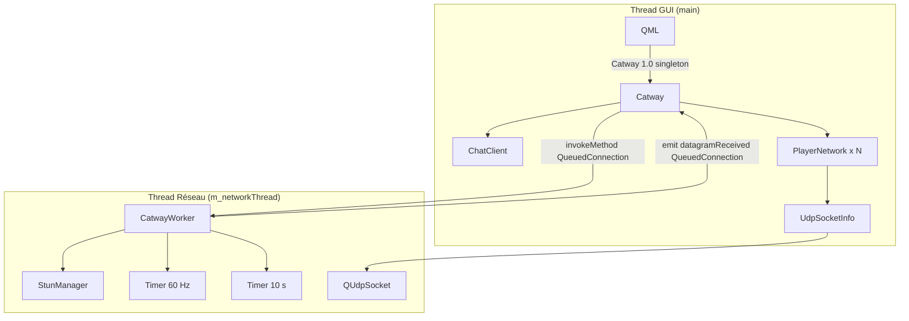
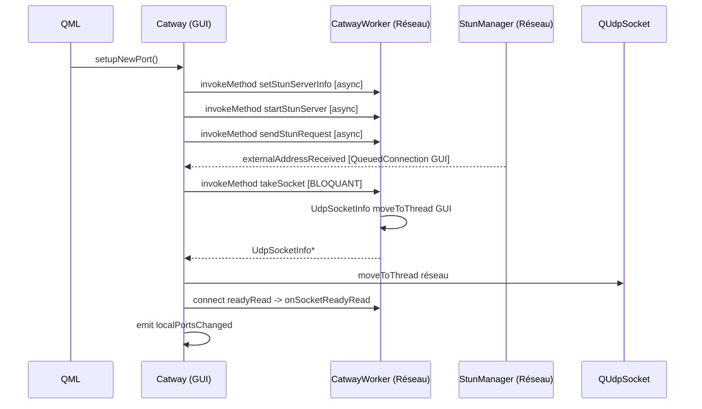
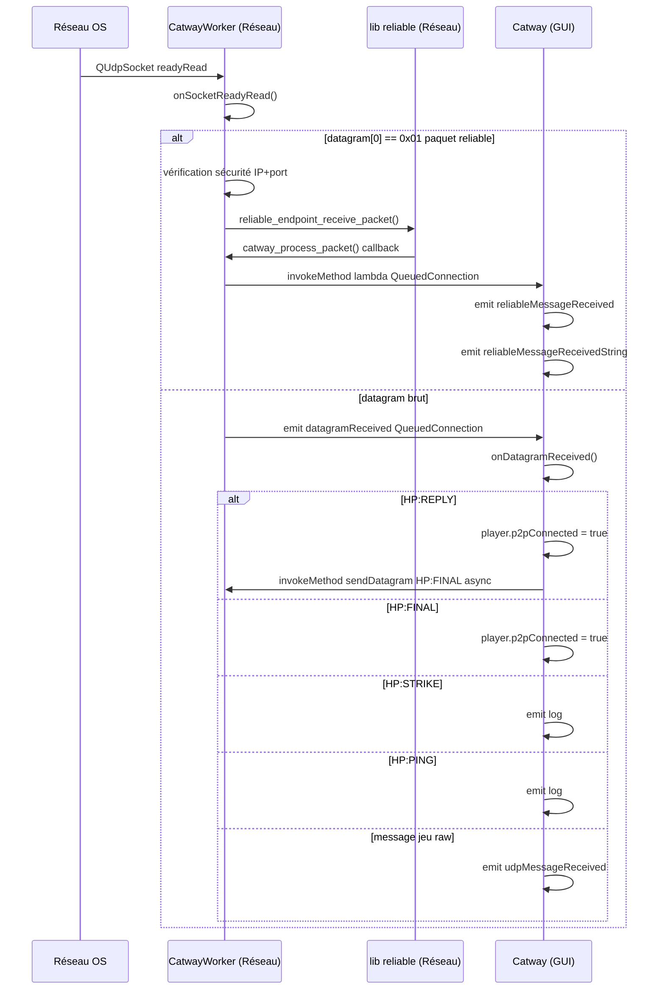
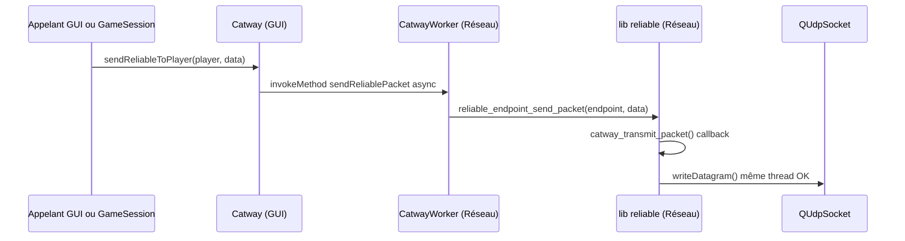
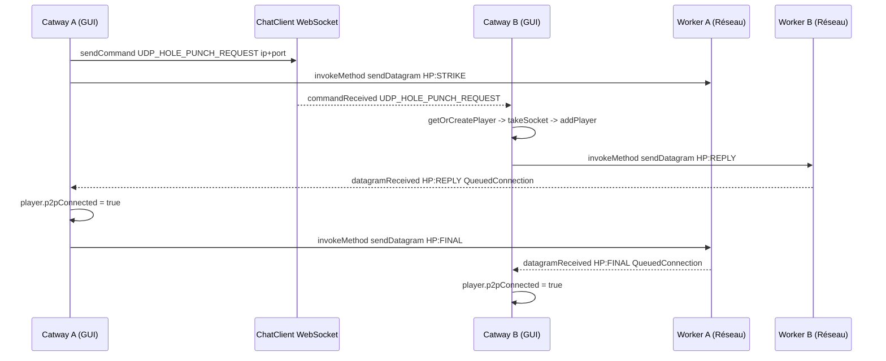
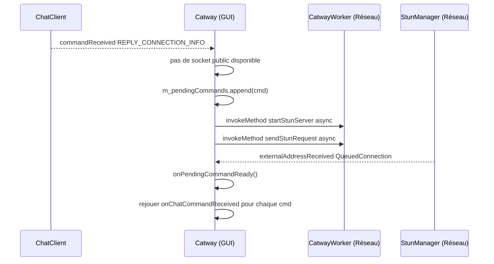

# Architecture détaillée de Catway

Ce document décrit en profondeur le fonctionnement interne de la classe `Catway` et de ses composants satellites : threads impliqués, responsabilités de chaque élément, flux d'interactions cross-thread, et suggestions de simplification architecturale.

---

## 1. Vue d'ensemble

`Catway` est un **singleton Qt** enregistré en QML (`import Catway 1.0`) qui orchestre tout le réseau P2P UDP du jeu. Pour ne pas bloquer le thread GUI avec les opérations réseau, il délègue les I/O à un objet worker vivant sur un thread dédié.



---

## 2. Composants et leurs threads

### 2.1 `Catway` — Thread GUI

Fichiers : `catway.h` / `catway.cpp`

Singleton exposé à QML. Il ne fait **jamais d'I/O réseau lui-même** : il délègue au worker via `QMetaObject::invokeMethod` et réceptionne les résultats par des signaux avec `Qt::QueuedConnection`.

Responsabilités :
- Enregistrement QML (`registerQml`) et point d'entrée `instance()`
- Gestion de la liste `m_players` (`QList<PlayerNetwork*>`)
- Gestion de la liste `m_localSocketInfos` (`QList<UdpSocketInfo*>`)
- Orchestration du hole punching (initiation + traitement des réponses)
- Traitement des commandes chat (`onChatCommandReceived`)
- Émission des signaux vers QML/GameSession

### 2.2 `CatwayWorker` — Thread Réseau (`m_networkThread`)

Fichiers : `catway.h` / `catway_worker.cpp`

Objet déplacé sur `m_networkThread` via `moveToThread`. Il possède tous les objets réseau actifs.

Responsabilités :
- Posséder et piloter `StunManager`
- Réceptionner les datagrammes UDP (`onSocketReadyRead`)
- Envoyer les datagrammes (`sendDatagram`)
- Piloter la lib `reliable` à ~60 Hz (`onReliableUpdate`)
- Émettre des heartbeats P2P (`HP:PING`) toutes les 10 s (`onHeartbeat`)
- Envoyer des paquets fiables (`sendReliablePacket`, `broadcastReliable`)

### 2.3 `StunManager` — Thread Réseau

Fichiers : `stun_manager.h` / `stun_manager.cpp`

Possédé par `CatwayWorker` (parent = worker, donc même thread). Gère :
- Le binding d'un `QUdpSocket` sur un port local
- L'envoi d'une requête STUN et le parsing de la réponse
- La fourniture du socket prêt via `takeSocket()` (recrée un nouveau socket en interne)
- La détection de timeout → signal `stunFailed`

### 2.4 `PlayerNetwork` — Thread GUI

Fichiers : `player_network.h` / `player_network.cpp`

QObject vivant sur le thread GUI, exposé en QML. Contient :

| Membre | Type | Usage |
|---|---|---|
| `m_playerId` | `QString` | Identifiant unique |
| `m_nickname` | `QString` | Pseudo affiché |
| `m_socketInfo` | `UdpSocketInfo*` | Socket local alloué à ce joueur |
| `m_ip` / `m_port` | `QString` / `quint16` | Adresse de destination distante |
| `m_p2pConnected` | `bool` | Connexion UDP établie (post hole-punch) |
| `m_endpoint` | `reliable_endpoint_t*` | Endpoint de la lib `reliable` |

> **Attention** : `m_endpoint`, `m_ip`, `m_port` et `m_p2pConnected` sont lus depuis le thread réseau (dans `onSocketReadyRead`, `onReliableUpdate`, `onHeartbeat`) sans verrou. Voir P1 et P8.

### 2.5 `UdpSocketInfo` — Propriété partagée (GUI/Réseau)

Fichiers : `udp_socket_info.h` / `udp_socket_info.cpp`

Objet dont la **propriété Qt** est sur le thread GUI (parent = `Catway`), mais dont le `QUdpSocket*` membre est **déplacé sur le thread réseau** après `takeSocket()`. Cette séparation est intentionnelle mais inhabituelle.

| Membre | Thread |
|---|---|
| `m_publicAddress`, `m_publicPort` | GUI (lecture/écriture depuis STUN signal) |
| `QUdpSocket* m_socket` | Réseau (I/O UDP) |

### 2.6 `CatwayReliableContext` — Pont inter-thread

Struct allouée sur le **thread GUI** (dans `addPlayer`), mais utilisée en lecture depuis le **thread réseau** par les callbacks C de la lib `reliable`.

```cpp
struct CatwayReliableContext {
    PlayerNetwork *player;  // vit sur GUI
    Catway        *catway;  // vit sur GUI
};
```

Elle est passée comme `void* context` à `reliable_endpoint_create`, et stockée actuellement via une propriété dynamique `_reliableCtx` sur le `PlayerNetwork` (voir P6).

### 2.7 Callbacks `catway_transmit_packet` / `catway_process_packet` — Thread Réseau

Fonctions libres statiques (portée fichier) définies dans `catway.cpp`. Passées à `player->initReliable()` comme callbacks C de la lib `reliable`. Elles sont appelées **depuis le thread réseau** lors des opérations d'envoi ou de réception de paquets fiables.

- `catway_transmit_packet` : sérialise le paquet reliable (préfixe `\x01`) et l'écrit directement sur le socket (même thread ✓).
- `catway_process_packet` : reçoit un paquet acquitté et émet les signaux `reliableMessageReceived` / `reliableMessageReceivedString` sur le thread GUI via `QMetaObject::invokeMethod(..., Qt::QueuedConnection)`.

### 2.8 Timer reliable (~60 Hz) — Thread Réseau

`QTimer` créé dans `CatwayWorker::startReliableTimer()`. Appelle `reliable_endpoint_update()` et `reliable_endpoint_clear_acks()` pour chaque joueur à chaque tick. Démarre dès que `m_networkThread` envoie le signal `started`.

### 2.9 Timer heartbeat (10 s) — Thread Réseau

`QTimer` créé dans le constructeur de `CatwayWorker`. Envoie `HP:PING` via UDP à chaque joueur dont `p2pConnected == true`, pour maintenir les trous NAT ouverts.

### 2.10 `ChatClient` — Thread GUI

WebSocket de signaling. Utilisé pour échanger les adresses publiques entre pairs (`UDP_HOLE_PUNCH_REQUEST`, `REPLY_CONNECTION_INFO`, `REQUEST_CONNECTION_INFO`) avant d'établir la connexion UDP directe.

---

## 3. Flux d'interactions cross-thread

### Flux A : Démarrer un nouveau port UDP (`setupNewPort`)



> `takeSocket()` utilise `Qt::BlockingQueuedConnection` : le thread GUI est suspendu le temps que le worker effectue le `moveToThread`. Voir P3.

---

### Flux B : Réception d'un datagramme UDP



> Les paquets `0x01` (reliable) sont traités **entièrement sur le thread réseau**. Seul l'émission du signal remonte sur le GUI via `QueuedConnection`.

---

### Flux C : Envoi d'un paquet fiable



---

### Flux D : Hole Punching complet



---

### Flux E : Commande chat avec STUN en attente (`PendingCommand`)

Ce flux couvre le cas où un pair envoie son adresse (`REPLY_CONNECTION_INFO`) avant que le récepteur ait un socket public disponible.



---

## 4. Problèmes identifiés et suggestions de simplification

### P1 — ~~Race condition sur `m_players`~~ ✅ Résolu

**Pattern snapshot** : Le worker ne touche plus jamais `Catway::instance()`. Il possède sa propre `QList<PlayerSnapshot>` mise à jour via `setPlayerSnapshots(Qt::QueuedConnection)` à chaque `addPlayer()`, `removePlayer()`, ou changement de propriété d'un joueur (`ipChanged`, `portChanged`, `p2pConnectedChanged`, `socketInfoChanged`). Tous les accès cross-thread ont été supprimés.

---

### P2 — ~~Déclarations de callbacks dans `CatwayWorker`~~ ✅ Résolu

Les déclarations de `catway_transmit_packet` et `catway_process_packet` ont été déplacées hors de la classe `CatwayWorker` dans le header. Leur appartenance est désormais claire : ce sont des fonctions libres liées au contexte de `Catway`, pas au worker.

---

### P3 — ~~`BlockingQueuedConnection` pour `getSocket` / `currentSocketInfo`~~ ✅ Résolu

`StunManager` émet désormais `currentSocketInfoChanged(UdpSocketInfo*)` après chaque bind réussi et après chaque `takeSocket()`. `Catway` connecte ce signal en `QueuedConnection` et met à jour `m_currentStunSocketInfo`. `getSocket()` et `currentSocketInfo()` lisent directement ce cache, sans aucun `BlockingQueuedConnection`.

---

### P4 — ~~Logique `PendingCommand` dupliquée~~ ✅ Résolu

La méthode privée `Catway::triggerStunForPendingCommand()` regroupe la logique commune. Les deux branches de `onChatCommandReceived` l'appellent désormais.

---

### P5 — ~~Reconnexion fragile du signal `datagramReceived`~~ ✅ Résolu

`datagramReceived` est connecté **une seule fois** dans le constructeur de `Catway` avec `Qt::QueuedConnection`. Les `disconnect/connect` manuels dans `takeSocket()` et `addPlayer()` ont été supprimés.

---

### P6 — ~~Stockage du `CatwayReliableContext` via `void*`~~ ✅ Résolu

`Catway` possède désormais `QHash<PlayerNetwork*, CatwayReliableContext*> m_reliableContexts`. La création et la destruction des contextes sont typées et explicites. `CatwayReliableContext` inclut également un pointeur `CatwayWorker*` pour que `catway_transmit_packet` puisse accéder au snapshot sans toucher `PlayerNetwork` depuis le thread réseau.

---

### P7 — ~~`emit log("HP:PING")` à chaque heartbeat reçu~~ ✅ Résolu

Le `emit log("HP:PING")` a été supprimé. La réception d'un heartbeat `HP:PING` est silencieuse.

---

### P8 — ~~`PlayerNetwork` accédé depuis deux threads~~ ✅ Résolu (via P1)

Résolu par le pattern snapshot de P1. Le worker n'accède plus jamais aux membres de `PlayerNetwork` depuis le thread réseau. `catway_transmit_packet` utilise désormais `ctx->worker->findSnapshot()` pour lire ip/port/socket depuis le snapshot du worker.

---

## 5. Résumé des priorités

| Priorité | Point | Statut |
|---|---|---|
| Haute | P1 — Race condition sur `m_players` | ✅ Résolu — pattern snapshot |
| Haute | P3 — `BlockingQueuedConnection` GUI | ✅ Résolu — cache via signal StunManager |
| Moyenne | P4 — Logique `PendingCommand` dupliquée | ✅ Résolu — `triggerStunForPendingCommand()` |
| Moyenne | P5 — Reconnexion fragile `datagramReceived` | ✅ Résolu — connexion unique en constructeur |
| Moyenne | P6 — `CatwayReliableContext` via `void*` | ✅ Résolu — `QHash` typé |
| Basse | P2 — callbacks hors `CatwayWorker` | ✅ Résolu |
| Basse | P7 — Log spam `HP:PING` | ✅ Résolu — `emit log` supprimé |
| Basse | P8 — `PlayerNetwork` cross-thread | ✅ Résolu — via P1 snapshot |
