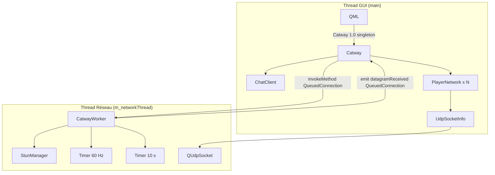
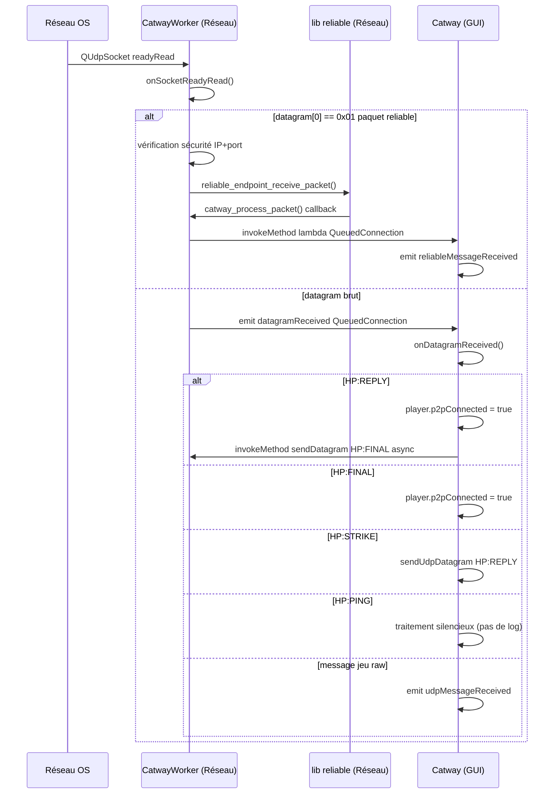
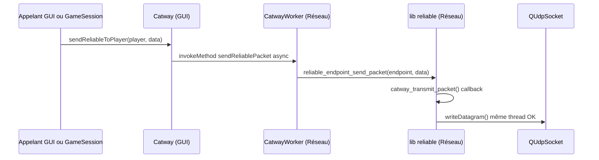
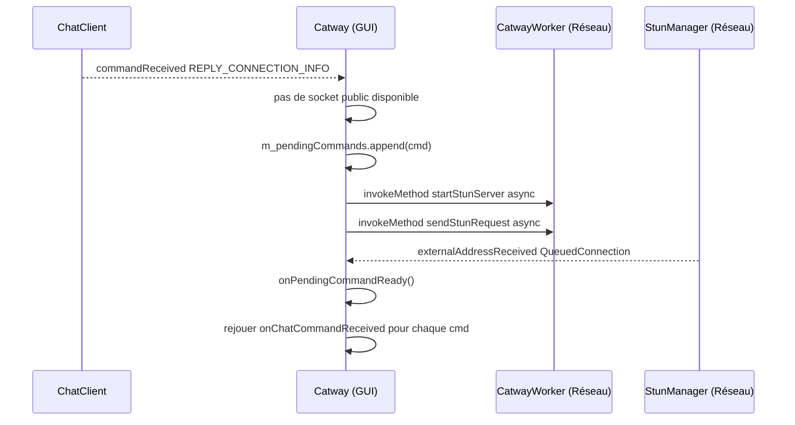

# Architecture détaillée de Catway

Ce document décrit en profondeur le fonctionnement interne de la classe `Catway` et de ses composants satellites : threads impliqués, responsabilités de chaque élément, flux d'interactions cross-thread, et historique des problèmes corrigés. Il est aligné avec la **répartition du code en plusieurs fichiers** (`catway.cpp`, `catway_stun.cpp`, `catway_player.cpp`, `catway_worker.cpp`) et les noms d’API actuels (`takeStunSocket`, etc.).

---

## 1. Vue d'ensemble

`Catway` est un **singleton Qt** enregistré en QML (`import Catway 1.0`) qui orchestre tout le réseau P2P UDP du jeu. Pour ne pas bloquer le thread GUI avec les opérations réseau, il délègue les I/O à un objet worker vivant sur un thread dédié.




---

## 2. Composants et leurs threads

### 2.0 Organisation des fichiers sources

L’implémentation de `Catway` est répartie sur plusieurs unités de compilation (une seule classe, plusieurs `.cpp`) pour clarifier les responsabilités :


| Fichier                                                          | Contenu principal                                                                                                                                                                                 |
| ---------------------------------------------------------------- | ------------------------------------------------------------------------------------------------------------------------------------------------------------------------------------------------- |
| `[catway.h](../../cpp/communication/catway.h)`                   | Déclarations `Catway`, `CatwayWorker`, `PlayerSnapshot`, `CatwayReliableContext`                                                                                                                  |
| `[catway.cpp](../../cpp/communication/catway.cpp)`               | Singleton, constructeur / destructeur, enregistrement QML, listes `localPorts` / `players`, chat, UDP, datagrammes, commandes chat, reliable broadcast                                            |
| `[catway_stun.cpp](../../cpp/communication/catway_stun.cpp)`     | Cache `m_currentStunSocketInfo`, `getSocket` / `currentSocketInfo`, `takeStunSocket`, flux STUN (`setupNewPort`, `onExternalAddressReceivedTakePort`), `triggerStunForPendingCommand`, échec STUN |
| `[catway_player.cpp](../../cpp/communication/catway_player.cpp)` | `pushPlayerSnapshots`, `addPlayer` / `removePlayer`, joueurs (`playerAt`, `getOrCreatePlayer`, …), callbacks C `catway_transmit_packet` / `catway_process_packet`                                 |
| `[catway_worker.cpp](../../cpp/communication/catway_worker.cpp)` | Thread réseau : timers, STUN proxy, sockets, reliable                                                                                                                                             |


Ces fichiers sont référencés dans `[Meownopoly.pro](../../Meownopoly.pro)` (`SOURCES`) aux côtés de `catway.cpp`.

### 2.1 `Catway` — Thread GUI

Fichiers : `catway.h` et les `.cpp` listés en 2.0.

Singleton exposé à QML. Il ne fait **jamais d'I/O réseau lui-même** : il délègue au worker via `QMetaObject::invokeMethod` et réceptionne les résultats par des signaux avec `Qt::QueuedConnection`.

Responsabilités :

- Enregistrement QML (`registerQml`) et point d'entrée `instance()`
- Gestion de la liste `m_players` (`QList<PlayerNetwork*>`)
- Gestion de la liste `m_localSocketInfos` (`QList<UdpSocketInfo*>`)
- Orchestration du hole punching (initiation + traitement des réponses)
- Traitement des commandes chat (`onChatCommandReceived`)
- Émission des signaux vers QML/GameSession

### 2.2 `CatwayWorker` — Thread Réseau (`m_networkThread`)

Fichiers : `catway.h` / `catway_worker.cpp`

Objet déplacé sur `m_networkThread` via `moveToThread`. Il possède tous les objets réseau actifs.

Responsabilités :

- Posséder et piloter `StunManager`
- Réceptionner les datagrammes UDP (`onSocketReadyRead`)
- Envoyer les datagrammes (`sendDatagram`)
- Piloter la lib `reliable` à ~60 Hz (`onReliableUpdate`)
- Émettre des heartbeats P2P (`HP:PING`) toutes les 10 s (`onHeartbeat`)
- Envoyer des paquets fiables (`sendReliablePacket`, `broadcastReliable`)

### 2.3 `StunManager` — Thread Réseau

Fichiers : `stun_manager.h` / `stun_manager.cpp`

Possédé par `CatwayWorker` (parent = worker, donc même thread). Gère :

- Le binding d'un `QUdpSocket` sur un port local
- L'envoi d'une requête STUN et le parsing de la réponse
- La fourniture du socket prêt via `StunManager::takeSocket()` (recrée un nouveau socket en interne) ; côté QML / façade, `Catway::takeStunSocket()` appelle le slot `CatwayWorker::takeStunSocket()` (même logique, nom explicite)
- Signal `currentSocketInfoChanged(UdpSocketInfo*)` après bind réussi et après `takeSocket()` interne (alimente le cache P3)
- La détection de timeout → signal `stunFailed`

### 2.4 `PlayerNetwork` — Thread GUI

Fichiers : `player_network.h` / `player_network.cpp`

QObject vivant sur le thread GUI, exposé en QML. Contient :


| Membre            | Type                   | Usage                                   |
| ----------------- | ---------------------- | --------------------------------------- |
| `m_playerId`      | `QString`              | Identifiant unique                      |
| `m_nickname`      | `QString`              | Pseudo affiché                          |
| `m_socketInfo`    | `UdpSocketInfo`*       | Socket local alloué à ce joueur         |
| `m_ip` / `m_port` | `QString` / `quint16`  | Adresse de destination distante         |
| `m_p2pConnected`  | `bool`                 | Connexion UDP établie (post hole-punch) |
| `m_endpoint`      | `reliable_endpoint_t*` | Endpoint de la lib `reliable`           |


Le worker n’accède plus directement à ces membres depuis son thread : il utilise les **snapshots** (`PlayerSnapshot`) poussés depuis le GUI (voir P1 / P8, section 4).

### 2.5 `UdpSocketInfo` — Propriété partagée (GUI/Réseau)

Fichiers : `udp_socket_info.h` / `udp_socket_info.cpp`

Objet dont la **propriété Qt** est sur le thread GUI (parent = `Catway`), mais dont le `QUdpSocket`* membre est **déplacé sur le thread réseau** après `takeSocket()`. Cette séparation est intentionnelle mais inhabituelle.


| Membre                            | Thread                                    |
| --------------------------------- | ----------------------------------------- |
| `m_publicAddress`, `m_publicPort` | GUI (lecture/écriture depuis STUN signal) |
| `QUdpSocket* m_socket`            | Réseau (I/O UDP)                          |


### 2.6 `CatwayReliableContext` — Pont inter-thread

Struct définie en fin de `[catway.h](../../cpp/communication/catway.h)`, allouée sur le **thread GUI** (dans `addPlayer`), utilisée depuis le **thread réseau** par les callbacks C de la lib `reliable`.

```cpp
struct CatwayReliableContext {
    PlayerNetwork *player;   // GUI-thread only — ne PAS accéder depuis le network thread
    QString        playerId; // copie thread-safe pour les callbacks réseau
    Catway        *catway;
    CatwayWorker  *worker;   // pour findSnapshot() dans catway_transmit_packet
};
```

Le champ `playerId` est une **copie thread-safe** : les callbacks réseau (`catway_transmit_packet`, `catway_process_packet`) utilisent `ctx->playerId` au lieu de `ctx->player->playerId()` pour éviter tout accès cross-thread au `PlayerNetwork`. Il est mis à jour dans `onPlayerNetworkPlayerIdChanged()`.

Stockage dans `Catway::m_reliableContexts` (`QHash<PlayerNetwork*, CatwayReliableContext*>`).

### 2.7 Callbacks `catway_transmit_packet` / `catway_process_packet` — Thread Réseau

Fonctions statiques en portée fichier, définies dans `[catway_player.cpp](../../cpp/communication/catway_player.cpp)`. Passées à `player->initReliable()` comme callbacks C de la lib `reliable`. Elles sont appelées **depuis le thread réseau** lors des opérations d'envoi ou de réception de paquets fiables.

- `catway_transmit_packet` : lit ip/port/socket via `ctx->worker->findSnapshot(playerId)` puis sérialise le paquet reliable (préfixe `\x01`) et écrit sur le socket (même thread ✓).
- `catway_process_packet` : reçoit un paquet acquitté et émet `reliableMessageReceived(senderId, QByteArray)` sur le thread GUI via `QMetaObject::invokeMethod(..., Qt::QueuedConnection)` (un seul signal ; pas de doublon QString).

### 2.8 Timer reliable (~60 Hz) — Thread Réseau

`QTimer` créé dans `CatwayWorker::startReliableTimer()`. Appelle `reliable_endpoint_update()` et `reliable_endpoint_clear_acks()` pour chaque joueur à chaque tick. Démarre dès que `m_networkThread` envoie le signal `started`.

### 2.9 Timer heartbeat (10 s) — Thread Réseau

`QTimer` créé dans le constructeur de `CatwayWorker`, **démarré dans `initReliable()`** (sur le network thread). Toutes les 10 secondes :

- **Joueurs `p2pConnected`** : envoie `HP:PING` pour maintenir les trous NAT ouverts. Si aucun paquet n'a été reçu depuis **30 secondes**, émet `playerTimedOut(playerId)` et le joueur est marqué déconnecté côté GUI.
- **Joueurs non connectés** (avec IP/port connus) : renvoie `HP:STRIKE` automatiquement (retry hole punch, max **15 essais** soit ~150s avant abandon).

Les timestamps de réception sont persistés dans `m_lastReceivedByPlayer` (QHash) pour survivre aux rebuilds de snapshots. Les compteurs de retry HP:STRIKE sont persistés dans `m_strikeRetryByPlayer`.

### 2.10 `ChatClient` — Thread GUI

WebSocket de signaling. Utilisé pour échanger les adresses publiques entre pairs (`UDP_HOLE_PUNCH_REQUEST`, `REPLY_CONNECTION_INFO`, `REQUEST_CONNECTION_INFO`) avant d'établir la connexion UDP directe.

---

## 3. Flux d'interactions cross-thread

### Flux A : Démarrer un nouveau port UDP (`setupNewPort`)


> `getSocket()` / `currentSocketInfo()` ne bloquent plus le GUI (cache P3). Seul `**takeStunSocket()**` utilise encore `Qt::BlockingQueuedConnection` pour récupérer le `UdpSocketInfo*` depuis le worker.

---

### Flux B : Réception d'un datagramme UDP




> Les paquets `0x01` (reliable) sont traités **entièrement sur le thread réseau**. Seul l'émission du signal remonte sur le GUI via `QueuedConnection`.

---

### Flux C : Envoi d'un paquet fiable




---

### Flux D : Hole Punching complet


---

### Flux E : Commande chat avec STUN en attente (`PendingCommand`)

Ce flux couvre le cas où un pair envoie son adresse (`REPLY_CONNECTION_INFO`) avant que le récepteur ait un socket public disponible.




La logique d’enchaînement STUN + file d’attente est centralisée dans `Catway::triggerStunForPendingCommand()` (`[catway_stun.cpp](../../cpp/communication/catway_stun.cpp)`) : au premier élément en file, on **déconnecte** `m_externalAddressTakePortConnection` (handler utilisé par `setupNewPort` / `onExternalAddressReceivedTakePort`) pour éviter un `takeStunSocket()` intempestif, puis on **connecte** `externalAddressReceived` vers `onPendingCommandReady` via `m_pendingCommandConnection`, déconnectée après traitement ou en cas d’échec STUN.

---

### Flux F : Détection same-network (NAT hairpinning)

Quand deux instances sont sur le même réseau (même IP publique STUN), les paquets UDP envoyés à l’IP publique ne reviennent pas (NAT hairpinning non garanti). Le système détecte cela automatiquement :

1. Les commandes chat `REQUEST_CONNECTION_INFO`, `REPLY_CONNECTION_INFO` et `UDP_HOLE_PUNCH_REQUEST` incluent un champ `localPort` en plus de `ip`/`port`.
2. Dans `onChatCommandReceived`, si l’IP publique du peer correspond à l’une de nos IPs publiques (`m_localSocketInfos` ou `m_currentStunSocketInfo`), l’adresse de destination est remplacée par `127.0.0.1:localPort`.
3. Cela permet le P2P sur la même machine (test dual-instance) ou sur le même réseau local.

---

### Flux G : Shutdown propre

1. `Catway::~Catway()` appelle `m_worker->tearDown()` via `BlockingQueuedConnection` → arrête les timers heartbeat et reliable.
2. `m_networkThread->quit()` puis `wait(3000)`.
3. Si le thread ne s’arrête pas dans les 3 secondes, `terminate()` + `wait()`.
4. Le worker est détruit automatiquement via `QThread::finished` → `deleteLater`.

---

### Test dual-instance

Le flag CLI `--instance N` (ex: `Meownopoly.exe --instance 2`) sépare le `applicationName` Qt, ce qui isole les QSettings et la base de données SQLite par instance. Le target CMake `dual_test_p2p` lance les deux instances automatiquement.

---

