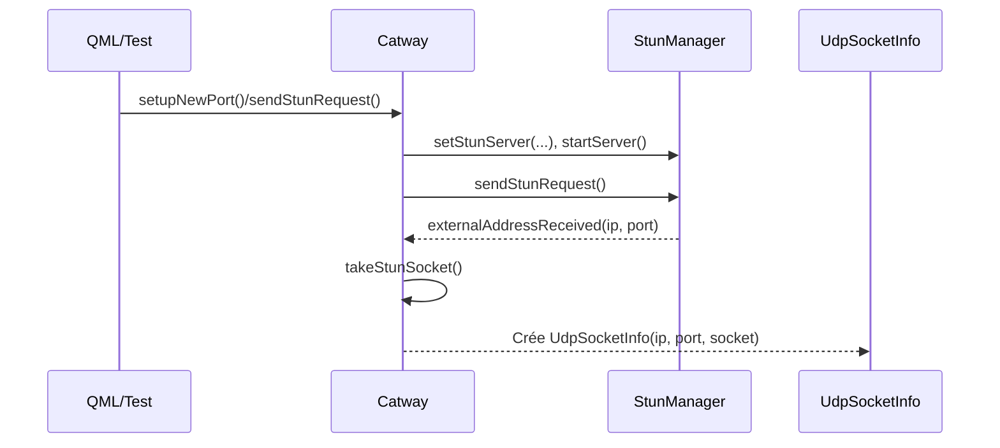
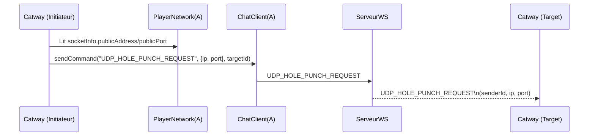
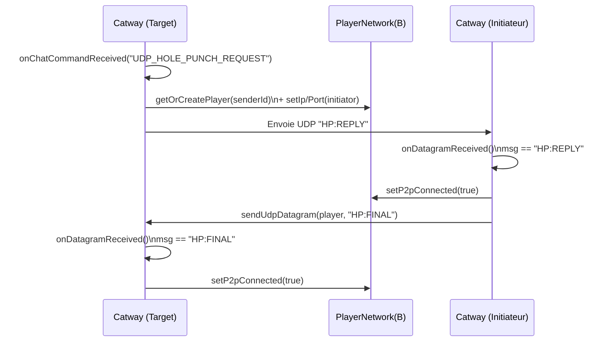
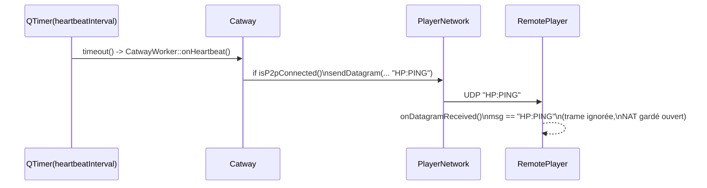
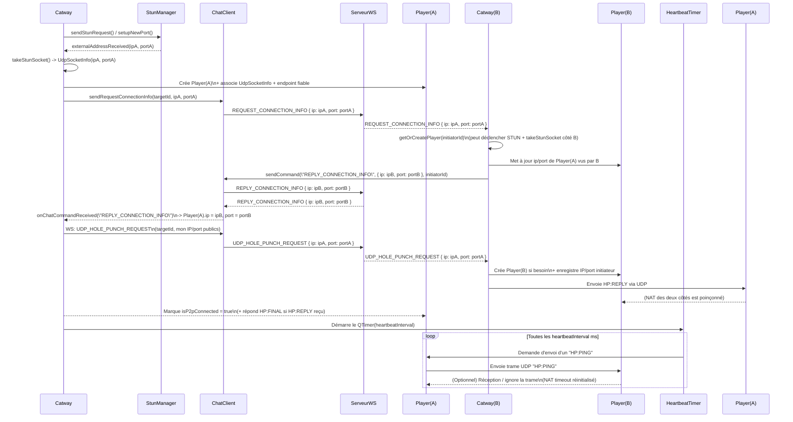

# Architecture Réseau P2P (Peer-to-Peer)

Ce document décrit l'architecture réseau mise en place dans Meownopoly (à travers le module `Catway`) pour permettre la communication Peer-to-Peer (P2P) entre les joueurs, le contournement des NAT via UDP Hole Punching, et l'envoi de messages fiables par-dessus UDP.

## 1. Composants Principaux

### 1.1 `Catway` (`catway.h` / `catway.cpp`)
C'est le gestionnaire central du réseau dans le jeu. Conçu comme un singleton accessible depuis QML et C++, il gère :
- La création et le suivi des connexions avec les autres joueurs.
- La communication avec le serveur STUN (via `StunManager`) pour récupérer l'adresse IP et le port publics du client.
- L'orchestration du processus de **UDP Hole Punching**.
- La réception et l'aiguillage des paquets UDP entrants (bruts ou fiables).
- La mise à jour à 60Hz des endpoints fiables via `CatwayWorker::onReliableUpdate`, exécutée sur le thread réseau (timer de 16 ms).

### 1.2 `PlayerNetwork` (`player_network.h`)
Représente un joueur distant sur le réseau. Chaque instance contient :
- Son identifiant (`playerId`) et pseudo (`nickname`).
- `socketInfo` (`UdpSocketInfo`) : Le socket UDP local spécifiquement alloué pour communiquer avec ce joueur.
- `ip` et `port` : L'adresse de destination publique du joueur distant.
- `endpoint` (`reliable_endpoint_t`) : La structure C de la bibliothèque `reliable.io`, gérant la fiabilité des paquets UDP (acquittements, retransmissions) pour ce joueur spécifique.

### 1.3 `UdpSocketInfo` (`udp_socket_info.h`)
Encapsule un `QUdpSocket` standard de Qt avec ses informations réseau publiques obtenues via le serveur STUN (`publicAddress`, `publicPort`). Le fait de séparer les sockets permet d'avoir un port local différent/dédié pour chaque pair si nécessaire.

### 1.4 `StunManager` (déduit)
S'occupe de forger et d'envoyer des requêtes vers un serveur STUN configuré. Lorsqu'une réponse est reçue, il émet l'adresse IP et le port publics vus de l'extérieur du réseau NAT du client. Le socket utilisé pour cette requête est ensuite récupéré par `Catway::takeStunSocket()` pour être assigné à un `PlayerNetwork`.

### 1.5 `ChatClient`
Utilisé comme un canal de signalisation (Signaling Channel). Le chat passe par un serveur central (WebSockets ou autre TCP) et permet aux joueurs de s'échanger leurs adresses IP et ports publics afin d'initier le P2P.

---

## 2. Processus de Connexion (UDP Hole Punching)

Pour que deux joueurs derrière des routeurs NAT puissent communiquer directement en UDP, le système utilise la technique de l'Hole Punching orchestrée par `Catway`.

### Étape 1 : Obtenir l'IP/Port publics (STUN)
Avant de se connecter, le client demande au serveur STUN son IP et son port publics (`sendStunRequest()` / `setupNewPort()`). Le socket ayant servi à cette requête est conservé dans un `UdpSocketInfo`.

#### Diagramme Étape 1 (STUN)

### Étape 2 : Échange des informations (Signaling)
1. Le joueur d'initiative (Initiator) appelle `Catway::initiateHolePunch(PlayerNetwork *player)`.
2. Il récupère l'IP/Port publics de son propre `UdpSocketInfo`.
3. Il envoie un message de chat spécial de type `UDP_HOLE_PUNCH_REQUEST` contenant son IP/Port via `ChatClient`.
4. Simultanément, il commence à envoyer des trames UDP factices ou d'initialisation (`HP:STRIKE`) vers la destination présumée du joueur distant pour "poinçonner" (punch) son propre routeur NAT.

#### Diagramme Étape 2 (Signaling UDP_HOLE_PUNCH_REQUEST)

### Étape 3 : Réponse et Finalisation de la connexion P2P
1. Le joueur cible (Target) reçoit le `UDP_HOLE_PUNCH_REQUEST` via le chat centralisé.
2. Il enregistre l'IP et le port de l'initiateur dans son `PlayerNetwork`.
3. Il répond en envoyant une trame UDP `HP:REPLY` vers l'initiateur. L'envoi de cette trame poinçonne son propre routeur NAT, permettant aux paquets de l'initiateur de rentrer.
4. L'initiateur reçoit le message UDP `HP:REPLY`. Le chemin P2P est désormais ouvert et fonctionnel dans les deux sens.
5. Il renvoie un message de confirmation UDP `HP:FINAL`.

#### Diagramme Étape 3 (Réponse HP:REPLY / HP:FINAL)

### Étape 4 : Maintien de la connexion (Heartbeat / Keep-Alive)
Une fois la connexion ouverte (réception de `HP:REPLY` ou `HP:FINAL`), le routeur NAT doit garder le "trou" ouvert. Les routeurs ferment généralement les ports inactifs au bout d'un certain temps de non-utilisation (ex: 30 à 120 secondes).
Pour éviter cela :
- L'instance de `CatwayWorker` déclenche un `QTimer` configuré à 10 secondes (`heartbeatInterval`).
- À chaque "tic", le système parcourt les snapshots des joueurs :
  - **Joueurs `p2pConnected`** : envoie `"HP:PING"` pour maintenir le trou NAT.
  - **Joueurs non connectés** (avec IP/port connus) : renvoie `"HP:STRIKE"` automatiquement (retry hole punch, max 15 essais).
- **Détection de timeout** : si aucun paquet n'a été reçu d'un joueur connecté depuis 30 secondes, le signal `playerTimedOut(playerId)` est émis et le joueur est marqué déconnecté (`p2pConnected = false`).
- Les timestamps de réception (`lastReceivedMs`) et compteurs de retry (`strikeRetryCount`) sont persistés côté worker dans des `QHash` pour survivre aux rebuilds de snapshots.

### Étape 4bis : Détection same-network (NAT hairpinning)
Quand deux joueurs partagent la même IP publique (même réseau local ou même machine), le NAT hairpinning n'est pas garanti. Le système détecte automatiquement cette situation :
- Les commandes chat incluent un champ `localPort` en plus de `ip`/`port`.
- Si l'IP publique du peer correspond à l'une de nos IPs publiques, l'adresse est remplacée par `127.0.0.1:localPort`.

#### Diagramme Étape 4 (Heartbeat HP:PING)

### 2.1 Diagramme de séquence : Initialisation d'un `PlayerNetwork` et Heartbeat

---

## 3. Communication en cours de jeu

Une fois le Hole Punching réussi, les joueurs peuvent s'envoyer des paquets directement (P2P). Le système supporte deux types d'envois multiplexés sur le même socket UDP :

### 3.1 UDP Brut (Raw)
Utilisé pour des requêtes simples, basiques, où la perte d'un paquet n'est pas critique ou est gérée manuellement par l'application (comme le trouage `HP:*` ou des événements peu importants).

### 3.2 UDP Fiable (Reliable)
Géré par la bibliothèque externe `reliable.io`. Permet un envoi garanti, gérant les numéros de séquence, les ACK (acquittements), retransmissions, et pings.
- Lorsqu'un message fiable est envoyé (`Catway::sendReliableToPlayer`), le paquet de données est préfixé d'un "magic byte" (le caractère `0x01`).
- Ce préfixe permet à la méthode de réception UDP (`CatwayWorker::onSocketReadyRead()`, exécutée sur le thread réseau) de différencier instantanément un paquet brut (legacy/jeu) d'un acquittement/paquet géré par la librairie fiable.
- Si le paquet commence par `0x01`, il est dépouillé de ce byte puis transmis à `reliable_endpoint_receive_packet` pour traitement par l'état interne de la librairie.
- Si le paquet est complet et validé, la callback C `catway_process_packet` émet le signal `reliableMessageReceived(playerId, data)` récupéré par le C++ ou le QML.

L'état des connexions fiables est maintenu à l'aide d'un `QTimer` s'exécutant toutes les 16 ms (60 Hz) qui appelle `reliable_endpoint_update` pour déclencher d'éventuels renvois de paquets non acquittés.
