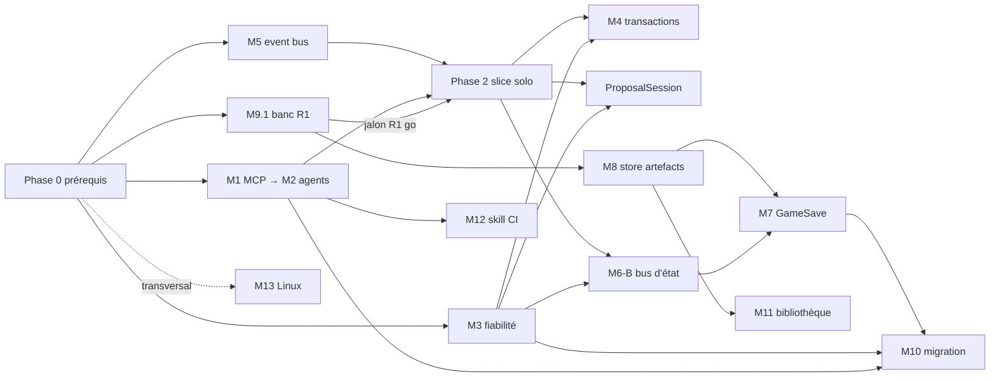

# 15 — Plan d'implémentation V3

> **Statut : draft (2026-07-17), établi pendant la revue des briques (SUIVI_REVUE_BRIQUES.md,
> docs [02](./02_CANAL_IA.md)→[13](./13_ENVELOPPE_PROPOSITION.md) pas encore revus en détail).** Ce plan compile les docs [00](./00_VISION.md)→[14](./14_ADAPTATEUR_AGENTS.md), le registre
> D1→D42, les chantiers M1→M13 ([doc 10](./10_AUDIT_STACK_EXISTANTE.md) §9-10) et une **revue du code V2** (fichiers et
> lignes vérifiés au 2026-07-17). Les arbitrages issus de la fin de la revue pourront
> amender les tâches concernées — chaque tâche référence ses docs sources pour re-vérification.
>
> Légende complexité : **F** = faible (heures), **M** = moyenne (~1-3 j), **É** = élevée
> (~1-2 sem), **TÉ** = très élevée (> 2 sem ou incertitude technique forte).
> Statut fichier : `[mod]` à modifier, `[new]` à créer, `[pat]` patron/lecture seule.

---

## 0. Vue d'ensemble du séquencement

Ordre directeur = [doc 10](./10_AUDIT_STACK_EXISTANTE.md) §10 + D23 (solo → collab → runtime) + [doc 11](./11_VERTICAL_SLICE.md) §6, organisé en
**6 phases** avec un **jalon go/no-go R1** en fin de Phase 1 :

```
Phase 0  Prérequis bloquants (P1→P5)
Phase 1  Fondations — 4 pistes PARALLÈLES :
         A: M9.1 banc d'essai (priorité n°1, jalon R1)   B: M3 fiabilité applicative
         C: M1 passerelle MCP → M2 superviseur agents     D: M5 journal d'événements
         ── JALON R1 (go/no-go D1, critères Q-J06) ──
Phase 2  Vertical slice solo (D30) : enveloppe/P0, confinement runtime,
         mémoire config, skill générée, scénarios S1/S2/S3
Phase 3  Collab : M4 transactions atomiques, ProposalSession (D40),
         M6-B bus d'état runtime (D35/D39)
Phase 4  Robustesse : M8 store artefacts, M7 sauvegarde de partie, M10 migration hôte
Phase 5  Distribution : M11 bibliothèque GLB, M12 industrialisation skill
Transversal  M13 Linux (démarre dès Phase 1, qualifie en continu)
```

Le pipeline produit à respecter partout (figé docs [12](./12_BANC_ESSAI_R1.md)/[13](./13_ENVELOPPE_PROPOSITION.md)) :
`proposition → P0 (hôte fait foi) → arbitre (grain D25) → banc P1→P5 → application → broadcast`.

---

## Phase 0 — Prérequis bloquants

Tous parallélisables entre eux. Rien d'autre ne doit démarrer avant P0-1 et P0-2
(qui bloquent respectivement M1 et M9).

### P0-1 · Installer l'add-on `QtHttpServer` (D21) — **F**
- Kit Qt 6.11.0 via Maintenance Tool ; vérifier `find_package(Qt6 COMPONENTS HttpServer)`.
- Fichiers : `Meownopoly/CMakeLists.txt` [mod].
- Repli documenté si indisponible : pont stdio `@modelcontextprotocol/sdk` (patron `automation_mcp/`).

### P0-2 · Assainir `ItemSnapable::toJSON()` (R4) — **M**
- Remplacer la concaténation manuelle de strings (`ItemSnapable.cpp:235-276`) par
  `QJsonObject`/`QJsonDocument` ; le round-trip `fromJson(toJSON())` (l.414) devient sûr.
  Seuls `NPCParameter`/`EnemyParameter` échappent correctement aujourd'hui — aligner tous
  les sous-paramètres (`toJSON()` délégués l.242-263).
- Fichiers : `cpp/game/item_snapable/ItemSnapable.{h,cpp}` [mod], sous-paramètres
  (`snapableParameters/*`) [mod], `itemsnapablefactory.cpp` [mod-léger].
- **Bloque** : snapshot du banc ([doc 12](./12_BANC_ESSAI_R1.md) §10), mémoire M6, GameSave M7.
- Risque : régression de persistance — tests round-trip sur les maps existantes obligatoires.

### P0-3 · Réserver la plage de types de messages V3 — **F**
- Occupé : Game 0x01–0x1F, Editor 0x20–0x3F (dernier 0x2A), Physics 0x40–0x47
  (« doit toujours être la plus haute », `physics_message_type.h:9`). Réserver **0x60+**
  pour V3 (ProposalSession D40, bus d'état D35, transactions, migration).
- Fichiers : `cpp/net/v3/v3_message_type.h` [new], commentaire croisé dans
  `editor_message_type.h` et `physics_message_type.h` [mod].
- Attention : les `isXxxPacket` filtrent par plage → collision = drop silencieux.

### P0-4 · Figer le contrat du canal : Q-E08 (manifeste 12 tools) + Q-E06 (résumé/curseur) — **M**
- Décision Antoine/Valou (propositions prêtes au [doc 09](./09_QUESTIONNAIRE_CADRAGE.md)) → écrire le **manifeste versionné
  du canal** (JSON, `protocolVersion`), source de vérité unique de M1 et M12 (D17).
- Fichiers : [`Meownopoly/doc/v3/09_QUESTIONNAIRE_CADRAGE.md`](./09_QUESTIONNAIRE_CADRAGE.md) [mod], manifeste
  `cpp/ai/gateway/channel_manifest.json` (emplacement indicatif) [new].
- **Bloque** : M1 (catalogue), M12 (skill), enveloppe (schéma dans le manifeste, [doc 13](./13_ENVELOPPE_PROPOSITION.md) §9).

### P0-5 · Gouvernance : Q-J08 (responsables par famille) + fin de revue SUIVI — **F**
- Attribuer produit/sécurité/réseau/gameplay/bibliothèque entre Antoine et Valou ;
  terminer la revue docs [02](./02_CANAL_IA.md)→[13](./13_ENVELOPPE_PROPOSITION.md) (le présent plan est amendé au fil de l'eau).

---

## Phase 1 — Fondations (4 pistes parallèles)

Les pistes A/B/C/D sont **indépendantes entre elles** (fichiers disjoints) et peuvent
être menées par deux devs + sessions IA en parallèle. La piste A est la priorité n°1
([doc 12](./12_BANC_ESSAI_R1.md) : ses mesures décident du maintien de D1).

### Piste A — M9.1 · Banc d'essai hors-process `meow_testbench` (D26, [doc 12](./12_BANC_ESSAI_R1.md))

| Tâche | Détail | Complexité |
|---|---|---|
| A1 · Cible CMake `meow_testbench` headless | `-platform offscreen`, sources listées explicitement (pattern `tests/CMakeLists.txt`, pas le GLOB) : sérialisation map, `ItemSnapableFactory`, Pattounx v2 cœur (`pattounx_engine_v2.*`, Qt-free), types QML nécessaires — **aucun module réseau lié** (pas de Catway/chat/PhysicsSession) | **É** |
| A2 · Protocole job/verdict | Job JSON en argument fichier (snapshot map+memory+modules, artefact, budgets D34 sérialisés, stimuli, seed) ; verdict une ligne `MEOWBENCH:` sur stdout ([doc 12](./12_BANC_ESSAI_R1.md) §2.3/§4) | **M** |
| A3 · Superviseur côté jeu | `cpp/ai/bench/bench_supervisor.{h,cpp}` [new] : `QProcess`, timeout dur `MEOW_BENCH_TIMEOUT_MS` (30 s) → kill → verdict synthétique ; auto-surveillance RSS 512 Mo côté banc | **M** |
| A4 · Préfiltre P0 in-game | `cpp/ai/sandbox/static_validator.{h,cpp}` [new] : parse QML, allow-list imports/types/JS D34, taille ≤ 20 KB, vérif `requiresModules` (D41). **Même code** hôte + auteur (fail-fast), l'hôte fait foi | **É** |
| A5 · Phases P1→P5 | Reconstruction snapshot → instanciation contexte restreint → 600 ticks à vide → stimuli générés (injection directe des événements de zone, reco [doc 12](./12_BANC_ESSAI_R1.md) §11) → teardown/leaks. Mesures p50/p95/max, write-set observé vs déclaré | **TÉ** |
| A6 · Contexte restreint + façade minimale | `cpp/ai/sandbox/restricted_context.{h,cpp}` + `meow_game_api.{h,cpp}` [new] : `QQmlContext` dédié, masquage des ~30 singletons de `qmlapp.cpp:84-115`, façade `Meow.GameApi` (D34 : memory, events, stats, présentation). **Code partagé banc/jeu** ([doc 12](./12_BANC_ESSAI_R1.md) §5) | **TÉ** |
| A7 · Corpus + critères R1 | `test_artifacts/` (9 artefacts [doc 12](./12_BANC_ESSAI_R1.md) §8) ; 3 runs reproductibles, kill 100 %, froid < 2 s, validation < 8 s, `acces_singleton.qml` bloqué | **M** |
| A8 · Pool + cache de verdicts | `MEOW_BENCH_POOL`, recyclage après fail/timeout et tous les 10 jobs ; cache clé `contentHash+benchVersion+hash(budgets)` ([doc 12](./12_BANC_ESSAI_R1.md) §6-7) | **M** |
| A9 · Tool `artifact_dryrun` (D42) | Branché plus tard sur M1 ; quota `MEOW_BENCH_DRYRUN_QUOTA`=10 ; *pass local ≠ acceptation* | **F** (une fois A1-A5 et M1 faits) |

Fichiers pivots : `Meownopoly/CMakeLists.txt` [mod], `cpp/qmlapp.cpp` [pat — liste des
singletons à masquer], `cpp/game/map/mapfilemanager.*` [pat], `ItemSnapable.cpp` [dépend P0-2],
`cpp/ai/bench/` + `cpp/ai/sandbox/` [new], `test_artifacts/` [new].

**🚩 JALON R1 (go/no-go, critères Q-J06)** : échec d'isolation → repli « palette + mémoire » ;
tick > 0,5 ms systématique → réduire à config modules + DSL ; sinon **go** pour la suite de D1.
Les phases 2+ qui dépendent du QML génératif ne s'engagent qu'après ce jalon (le reste des
pistes B/C/D n'en dépend pas et continue).

### Piste B — M3 · Fiabilité applicative au-dessus de Catway

| Tâche | Détail | Complexité |
|---|---|---|
| B1 · Enveloppe commune V3 | `{messageId, sessionId, senderId, kind, seq, correlationId, payloadHash}` sur la plage 0x60+ (P0-3) | **M** |
| B2 · ACK applicatif + retry + dédup (commits) | File de retransmission **côté worker** (la façade est en `QueuedConnection`) ; capturer les acks **avant** `reliable_endpoint_clear_acks` (`catway_worker.cpp:155-156`, cœur du problème E06/F06) ; plafonds de file et de retries, échec définitif remonté au métier | **TÉ** |
| B3 · État supersédable | Séquence monotone, drop de l'ancien, réparation par snapshot (consommé par M6-B) | **M** |
| B4 · Chunking réparable | Reprendre `sendReliableOrChunked`/`handleOpChunk` (`editor_session.cpp:191/489`) : ID de transfert, bitmap des chunks reçus, demande des manquants, timeout, checksum final (aujourd'hui un chunk perdu bloque le réassemblage, l.507) | **É** |
| B5 · Harnais de test réseau | Perte/duplication/réordonnancement/corruption simulés (critères [doc 10](./10_AUDIT_STACK_EXISTANTE.md) M3) — base : harness `qml/test/CatwayTest/` | **É** |

Fichiers : `cpp/communication/catway.{h,cpp}` [mod — `catway.cpp:322/332`],
`catway_worker.cpp` [mod — critique], `player_network.{h,cpp}` [mod — métriques RTT pour
retry adaptatif], `cpp/reliable/` [pat], `cpp/net/v3/` [new]. Ne pas modifier le
comportement des messages V2 avant migration explicite de chaque consommateur.

### Piste C — M1 · Passerelle MCP → M2 · Superviseur d'agents (séquentiel dans la piste)

| Tâche | Détail | Complexité |
|---|---|---|
| C1 · `AiGatewayServer` MCP streamable HTTP loopback | `cpp/ai/gateway/ai_gateway_server.{h,cpp}` [new] sur `QtHttpServer` (P0-1) : JSON-RPC 2.0 `initialize`/`tools/list`/`tools/call`, SSE optionnel. Patron : `automation_server.cpp` (loopback strict, revérif `peerAddress()`, dispatch GUI-thread) — **AutomationServer inchangé et test-only** | **É** |
| C2 · Auth + rôles + quotas | Token éphémère par session injecté au spawn (D20), rôles `proposer`/`arbiter` à capacités distinctes, quotas/rate-limit/taille max, erreurs `{code, message, details, retryable}` | **M** |
| C3 · Tools MVP (manifeste P0-4) | 12 tools Q-E08 ; traduction vers les hooks existants (`editorAutomationHooks`, `Editor.qml:2634-3118`) via le chemin UI exact (`placeSelectedAsset`+`Game.updateMap`, compatible collab/undo) | **É** |
| C4 · Capacités manquantes ([doc 02](./02_CANAL_IA.md) §5.2) | `state.listTiles/getTile` (uuid), `editor_edit` par uuid (move/resize/delete/link), `state.enum(...)`, hooks roster (`PlayerProfile`/`MapInfo` — les ops collab 12-16 existent, aucun hook), screenshot D22 (plafond 5/requête, `#define`) | **É** |
| C5 · `AiProcessSupervisor` (M2, [doc 14](./14_ADAPTATEUR_AGENTS.md)) | `cpp/ai/ai_process_supervisor.{h,cpp}` [new] : `QProcess` (aucun QProcess dans le code aujourd'hui — chantier neuf), adaptateurs `claude -p`/Codex séparés, start/stop gracieux/kill/timeout/crash/restart, stdout/stderr bornés, env-only pour les secrets (jamais en ligne de commande), **aucun orphelin à la fermeture**. États QML `Stopped/Starting/Ready/Failed/Restarting` | **É** |
| C6 · Handshake + challenge arbitre (D24/D31) | Vérification de rôle/capacité avant ouverture du mode IA ; lobby 4 états, bouton grisé hors `Prêt`, re-test manuel/auto | **M** |
| C7 · Tchat ingame IA | UI nouvelle (drawer façon `ChatDrawer` en réutilisant les composants `qml/chat/` — distinct du chat multijoueur/`ChatClient`) : une invocation = un tour, verdicts `audience: player`, progression, info captures D22 | **É** |
| C8 · Skill générée v1 (M12 minimal, D17) | `scripts/generate_ai_skill.*` [new — dossier `scripts/` à créer] : manifeste (P0-4) → `SKILL.md` + contrat machine, injection en pré-prompt au spawn. La validation de dérive CI attend M13 | **M** |

Ordre interne : C1→C2→C3 puis C4 ∥ C5 ; C6/C7 après C5 ; C8 dès P0-4 (parallélisable avec tout).
Fichiers : `cpp/main.cpp` [mod — instanciation opt-in l.62-68], `cpp/qmlapp.cpp` [mod —
enregistrement superviseur], `qml/launcher/*.qml` [mod], `automation_mcp/` [pat],
`cpp/launcher/launcher_manager.*` [pat — forme des états seulement].

### Piste D — M5 · Journal d'événements métier `GameplayEventBus`

| Tâche | Détail | Complexité |
|---|---|---|
| D1 · Bus + ingestion | `cpp/game/events/gameplay_event_bus.{h,cpp}` + `event_types.h` [new] : événements typés `{id, auteur, source, ts logique, causalité, version}` ; horloge Lamport existante réutilisée (`game_lamport.cpp`) ; adaptation des signaux `Game` (`game.h:105-121`), `EditorOpBus`, `ItemSnapableEvents` (`item_snapable_events.h:47-51`), `PhysicsSession` — attention aux threads (physique = worker) | **É** |
| D2 · Curseur + noyau d'audit (D19) | Séquence monotone, reprise par curseur, snapshot si journal tronqué (`{truncated, oldestSeq}`, Q-E06) ; noyau d'audit non désactivable (proposition, verdict, raisons, amendement, version) | **M** |
| D3 · Protections D12 | File transactionnelle, profondeur max, budget de cascade, détection cycles/write-set | **M** |
| D4 · Branchement canal | `events_poll(cursor)` + résumé injecté par invocation (schéma Q-E06) — se branche sur C3 quand M1 est prêt | **F** |

Fichiers : `cpp/game/events/` [new], `cpp/tools/logger.{h,cpp}` [mod — rétention configurable].

---

## Phase 2 — Vertical slice solo (D30, [doc 11](./11_VERTICAL_SLICE.md))

Prérequis : jalon R1 **go**, C1-C3/C5-C7 opérationnels, D1-D2 posés. Objectif : le fil
rouge « plaque piégée » de bout en bout (S1 création, S2 arbitrage+banc, S3 rejet actionnable).

| Tâche | Détail | Fichiers pivots | Complexité |
|---|---|---|---|
| S-1 · Enveloppe de proposition + cycle de vie ([doc 13](./13_ENVELOPPE_PROPOSITION.md)) | Schéma `envelopeVersion: 1`, `requestType` **recalculé par P0** (jamais déclaré), `baseVersion`/`stale_base`, machine à états `draft→…→applied`, file `queued` si arbitre indisponible ; constantes `MEOW_PROPOSAL_*` | `cpp/ai/proposal/` [new] | **É** |
| S-2 · Verdict 2 audiences + retour MCP | `arbiter_verdict` (token arbiter only), `reasons[audience=player/ai]`, amendement = patch (repasse au banc, D32), `artifact_submit` bloquant 60 s puis `{status: pending}` | `cpp/ai/proposal/`, gateway | **M** |
| S-3 · Mémoire Étape A ([doc 05](./05_ESPACE_MEMOIRE_SNAPABLE.md), D15) | `QVariantMap m_userMemory` sur `ItemSnapable` + `Q_PROPERTY userMemory` + `setMemoryValue` + 2 signaux (`userMemoryChanged`, `memoryValueChanged(ns,key,value,version)`) ; clé `"memory"` dans `toJSON`/`applyJson` (voyage gratuitement dans `EditDelta` before/after → persistance + undo config) ; garde anti-boucle réactive, pas d'émission si valeur inchangée | `ItemSnapable.{h,cpp}` [mod], `editdelta.h` [pat] | **É** |
| S-4 · Portée session + joueurs (D15) | Objet C++ mémoire pour la session et les joueurs (conception à valider — question ouverte [doc 05](./05_ESPACE_MEMOIRE_SNAPABLE.md)) | `cpp/game/memory/memory_store.*` [new] | **M** |
| S-5 · `module_config` (D41) | Tool + op `structure` intégrable au lot ; vérif `requiresModules` dans P0 (A4) ; état modules dans le snapshot du banc | `GameplayModuleManager` [mod], gateway | **M** |
| S-6 · Façade `Meow.GameApi` complète MVP (D34) | `memory.get/set/onChanged`, `events.on/emit`, `session.get`, `player.position`, `zone.playersInside`, `stats.addModifier`, `dialogue.show`, `anim.play`, `fx.spawn`, `sound.play` — prolonge A6, budgets runtime derrière `#define` | `cpp/ai/sandbox/meow_game_api.*` [mod] | **É** |
| S-7 · Scénarios S1/S2/S3 + instrumentation | Critères [doc 11](./11_VERTICAL_SLICE.md) §5 : zéro accès hors canal, zéro gel GUI, audit rejouable, mesure tokens/invocation (Q-E08), convergence ≤ 2 itérations sur échec mécanique ; indicateurs Q-J04 (latence arbitrage p50/p95, taux accept/amend) | harness + `qml/test/` | **M** |

Parallélisme interne : S-1/S-2 ∥ S-3/S-4 ∥ S-5 (fichiers disjoints), puis S-6 → S-7 (intégration).

---

## Phase 3 — Collab (après le slice, D23)

| Tâche | Détail | Fichiers pivots | Complexité |
|---|---|---|---|
| T3-1 · M4 transactions atomiques | `prepare/commit/rollback` : prévalidation complète avant première mutation (aujourd'hui `beginTransaction` = simple QUuid, mutations au fil de l'eau — `game_loader.cpp:385-405`) ; rollback via inverses `before` d'`EditDelta` ; write-set vérifié au commit ; attention au triple rôle de `groupId` (tx/undo/batch réseau) et au couplage save-on-commit (debounce 500 ms) | `game_loader.cpp`, `game.h`, `map.cpp`, `editor_op_bus.{h,cpp}` [mod], `cpp/game/tx/` [new] | **TÉ** |
| T3-2 · `ProposalSession` (D40) | Session dédiée patron `COLLAB_SESSION_PATTERN`, plage 0x60+, transport commit M3 (ACK+dédup par `proposalId`, chunking B4) ; source auteur→hôte uniquement (D16) ; une proposition en `benching/applying` à la fois | `cpp/ai/network/proposal_session.{h,cpp}` [new] | **É** |
| T3-3 · M6-B bus d'état runtime (D35/D39) | `cpp/game/memory/state_bus.*` [new] : intentions client→hôte, LWW séquencé, deltas coalescés 30 Hz par (tuile, clé), snapshot de réparation ~5 s/128 deltas + hash de divergence (D39) + `RequestStateSnapshot`, snapshot structurel ; plafonds D35 (1 KB/valeur, 8 KB/tuile, 256 KB/session, 64 KB/s/pair, rejet `quota_exceeded`). Patron : `physics_session.cpp:332-337` (**ré-implémenter générique, ne pas fusionner** — audit F04) | `physics_session.*` [pat], `state_bus.*` [new] | **TÉ** |
| T3-4 · Mémoire Étape C : undo ciblé (D28) | Write-set durable déclaré par proposition → inverse undoable ciblé ; restaure malgré modification concurrente (LWW assumé, trace journal) ; comportement du redo à trancher | `map.cpp`, `editor_op_bus.*` [mod] | **M** |
| T3-5 · Slice collab | Proposition d'un client distant, autorité hôte, P0 hôte fait foi | intégration | **M** |

Parallélisme : T3-1 ∥ T3-2 ∥ T3-3 (fichiers disjoints, tous dépendent de M3) ; T3-4 après T3-1 ; T3-5 en intégration finale.

---

## Phase 4 — Robustesse (runtime, reprise, migration)

| Tâche | Détail | Fichiers pivots | Complexité |
|---|---|---|---|
| T4-1 · M8 store d'artefacts par hash (D16/D36) | `cpp/artifacts/artifact_registry.*` + `artifact_store.*` [new] : une copie par SHA-256 sous `AppDataLocation/artifacts/`, manifeste (type, schemaVersion, auteur, deps, execPolicy, budgets, champs signature réservés D38), références `{instanceId, contentHash, manifestVersion}` sur les tuiles, refcount + GC au save, désactivation+diagnostic si absent. Brique SHA-256 existante : `launcher_manager.cpp:179-188` [pat — extraction prudente, monolithe 1618 l.] | `ItemSnapable.*` [mod], `asset_manager.*` [mod] | **É** |
| T4-2 · M7 sauvegarde de partie (D27) | `cpp/game/save/game_save.*` [new] : type distinct de `MapTypes`, référence map par `{id, version, hash}`, porte règlement versionné + `memory.state` + joueurs + artefacts/hashes + horloges/séquences ; I/O atomique réutilisée (`mapfilemanager.cpp:261-284`, `.tmp`+rename) ; espace de nommage séparé des sentinelles `autosave_tmp`/`_map.json` ; secrets exclus/chiffrés | `game_loader.cpp` [pat], `mapfilemanager.*` [pat] | **É** |
| T4-3 · M10 migration d'hôte V3 (D37) | Checkpoint = règlement + hashes artefacts + snapshot `state`+séquence (bloquants) + contexte arbitre (best-effort) ; suspension des propositions jusqu'au handshake D24 + ACK checkpoint ; coordination des deux `HostLeaving` (Editor 0x2A, Physics 0x46) pour éviter deux autorités ; logique éclatée C++/QML à consolider | `editor_session.{h,cpp}` [mod — l.558/571], `Editor.qml`, `main.qml` [mod — p2pStateMachine l.167-401], `chat_client.*` [mod] | **TÉ** |
| T4-4 · Règles runtime (D8/D12/D33) | Règlement structuré versionné (champ `rulebook` de `baseVersion`), matérialisation hiérarchique config→DSL→QML/JS, ordre déterministe physique→mémoire→actions→tick via la file D12. **[Doc 06](./06_MOTEUR_REGLES.md) = le moins cadré : re-cadrer avant d'engager** (après stabilisation docs [04](./04_QML_GENERATIF_SANDBOX.md)/[05](./05_ESPACE_MEMOIRE_SNAPABLE.md) + cartographie gameplay V2) | `cpp/game/rules/` [new, à cadrer] | **TÉ** (cadrage inclus) |
| T4-5 · Slice runtime | Règles déclenchées en partie, undo concurrent, reconnexion/resync | intégration | **É** |

Parallélisme : T4-1 ∥ T4-2 (T4-2 consomme T4-1 pour les hashes mais peut démarrer sur son format) ;
T4-3 après T4-1+T4-2 ; T4-4 cadrable en parallèle dès la Phase 2.

---

## Phase 5 — Distribution

| Tâche | Détail | Fichiers pivots | Complexité |
|---|---|---|---|
| T5-1 · M11 bibliothèque officielle GLB (D18/D29/D38) | Package format asset-manager étendu (identité/métadonnées/contenu/deps/compat, champs confiance **réservés** — signature différée D38/R16), installation atomique par dossier de version + commutation de manifeste, références `(category,type,id)`/`modelName` étendues version+hash, budgets assets provisoires validés sur un premier package de test | `asset_server/server.js`, `launcher_manager.*`, `asset_manager.*`, `KuraModel.qml`, `SkinnedModel.qml` [mod] | **É** |
| T5-2 · M12 industrialisation skill | Validation de dérive en CI (échec build si schéma non régénéré), variantes Codex/Claude, négociation de version au handshake | `scripts/generate_ai_skill.*` [mod], CI | **M** |

T5-1 ∥ T5-2, et T5-1 peut même démarrer plus tôt ([doc 07](./07_BIBLIOTHEQUE.md) §4 : le versant assets 3D ne dépend
pas du sandbox — instructible dès la Phase 1 si des bras sont libres).

### État d'implémentation — observabilité UI T4/T5 (2026-07-19)

L'onglet **Test Catway → V3 IA** couvre désormais les phases 0 à 5. Les
fonctionnalités livrées depuis T4-1 ne sont plus limitées aux API C++/hooks MCP :

- `V3ArtifactPanel.qml` : enregistrement texte, manifeste, contenu, refcount et
  GC explicite du store T4-1 ;
- `V3GameSavePanel.qml` : capture runtime, écriture/lecture atomique, catalogue
  et aperçu JSON des `GameSave` T4-2 ;
- `V3MigrationPanel.qml` : rôle, roster, suspension, checkpoint D37 et actions
  de reprise T4-3 ;
- `V3RulesPanel.qml` : règlement live, ajout d'une règle DSL de démonstration,
  tick, compteurs et journal des règles T4-4/T4-5 ;
- `V3LibraryPanel.qml` : scan des modèles, manifeste installé, résolution,
  intégrité et validation des budgets T5-1.

Écart assumé : T5-2 reste visible par les panneaux superviseur/passerelle et
par la CI, car la génération de skill et la détection de dérive n'ont pas
d'état runtime supplémentaire à administrer dans l'application.

Tous les contrôles interactifs de ces onze panneaux utilisent désormais les
composants canoniques `qml/ui_item` (`MeowButton`, champs, listes, switches,
cases à cocher, ainsi que `MeowTextArea` et `MeowTabButton`). Le parcours est
documenté dans la [présentation web interactive](./tutorial-interface-v3/index.html),
illustrée par des captures du build Release.

## Transversal — M13 · Qualification Linux (démarre en Phase 1)

| Tâche | Détail | Complexité |
|---|---|---|
| L1 · Preset/toolchain Linux | `CMakePresets.json` [new — absent], purge des chemins Android absolus (`CMakeLists.txt:175-176`, `C:/Users/Antoine/...`), packaging + déploiement plugins QML/Quick3D/CanvasPainter (gérer l'absence de `Qt6::CanvasPainter`) | **É** |
| L2 · Porter `dual_test_p2p` | Sans `cmd /c start` (`CMakeLists.txt:206-215`, sous `if(WIN32)`) | **F** |
| L3 · CI Windows + Linux | Tests Pattounx + scénarios automation + corpus du banc sur les 2 OS ; valider `MAP_FILE_PATH ("./map/")` (casse/CWD), permissions token, `AppDataLocation`, GLB, sandbox | **É** |

Le code métier est déjà portable (audit §7) : chantier essentiellement CMake/CI/packaging.
Chaque brique nouvelle (banc, gateway, superviseur) est testée sur Linux **au fil de l'eau**,
pas en fin de projet.

---

## 6. Matrice de dépendances et parallélisme



**Lots parallélisables (résumé opérationnel, 2 devs + agents)** :

| Fenêtre | En parallèle | Fichiers disjoints ? |
|---|---|---|
| Phase 0 | P0-1 ∥ P0-2 ∥ P0-3 ∥ P0-4 ∥ P0-5 | oui |
| Phase 1 | Piste A ∥ Piste B ∥ Piste C ∥ Piste D (+ L1/L2, + T5-1 si dispo) | oui (A: `cpp/ai/bench+sandbox`, B: `cpp/communication`, C: `cpp/ai/gateway+supervisor`, D: `cpp/game/events`) |
| Phase 2 | S-1/S-2 ∥ S-3/S-4 ∥ S-5, puis S-6→S-7 | oui sauf intégration |
| Phase 3 | T3-1 ∥ T3-2 ∥ T3-3 | oui (`cpp/game/tx`, `cpp/ai/network`, `cpp/game/memory`) |
| Phase 4 | T4-1 ∥ T4-2 ∥ (cadrage T4-4) | oui |
| Phase 5 | T5-1 ∥ T5-2 | oui |

**Points de sérialisation incompressibles** : P0-2 avant tout snapshot (A2/A5, S-3) ;
P0-4 avant C3/C8 ; jalon R1 avant tout engagement lourd sur le QML génératif (Phase 2 S-6,
Phase 4 T4-4) ; M3 (B2/B4) avant T3-1/T3-2/T3-3 ; handshake arbitre (C6) avant S2 du slice.

---

## 7. Registre des risques appliqué au plan

| Risque | Où il est traité dans le plan |
|---|---|
| R1 sandbox infaisable | Piste A entière + jalon R1 (Q-J06) — c'est pour ça qu'elle est première |
| R2 RCE inter-joueurs | `executionPolicy: host_only` par défaut (S-1) ; réplication par pair seulement après R1 complet |
| R3 canal détourné | C2 (token au spawn, loopback strict) |
| R4 sérialisation cassée | P0-2 (bloquant, en tête de plan) |
| R5 dérive skill | C8 + T5-2 (source de vérité unique = manifeste) |
| R7 arbitre pris pour garde-fou | invariant pipeline : le banc (A) valide toujours, même le code amendé (D32) |
| R8 latence/coût arbitrage | grain D25 dans S-1 ; mesures Q-J04 dès S-7 |
| R11 boucle JS gèle le GUI | A3/A5 (kill au banc) + budgets runtime S-6 |
| R13 reliable.io pris pour fiable | Piste B entière (B2 en particulier) |
| R14 transaction groupée ≠ atomique | T3-1 |
| R15 migration sans contexte arbitre | T4-3 (checkpoint D37) |
| R16 SHA-256 ≠ signature | assumé au MVP (D38) ; champs réservés dans T4-1/T5-1 ; à régler avant tout contenu communautaire |

---

## 8. Ce que ce plan ne tranche pas (à ré-arbitrer en revue)

- [Doc 02](./02_CANAL_IA.md) Q2/Q3 (frontière tools locaux vs proposition ; chiffrage des quotas) et Q-E06
  (posée, en attente) — voir SUIVI §5.
- [Doc 05](./05_ESPACE_MEMOIRE_SNAPABLE.md) : nom final des namespaces, `MemorySnapshot` dédié vs extension du snapshot
  physique, comportement du redo (Étape C).
- [Doc 06](./06_MOTEUR_REGLES.md) : tout le volet règles runtime (T4-4 inclut son propre re-cadrage).
- [Doc 12](./12_BANC_ESSAI_R1.md) §11 : types QML enregistrés dans le banc (reco : strict nécessaire), confinement
  OS post-MVP, session atelier (palier 2 D42).
- [Doc 13](./13_ENVELOPPE_PROPOSITION.md) §10 : `expiresAt`, propositions concurrentes du même auteur, taille du
  `playerPrompt` journalisé (lié Q-J02).
- [Doc 14](./14_ADAPTATEUR_AGENTS.md) : politique de redémarrage, onboarding CLIs, UI exacte du tchat.
